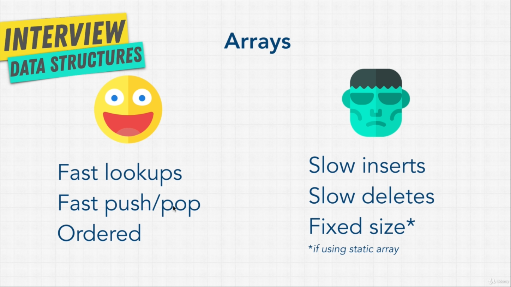
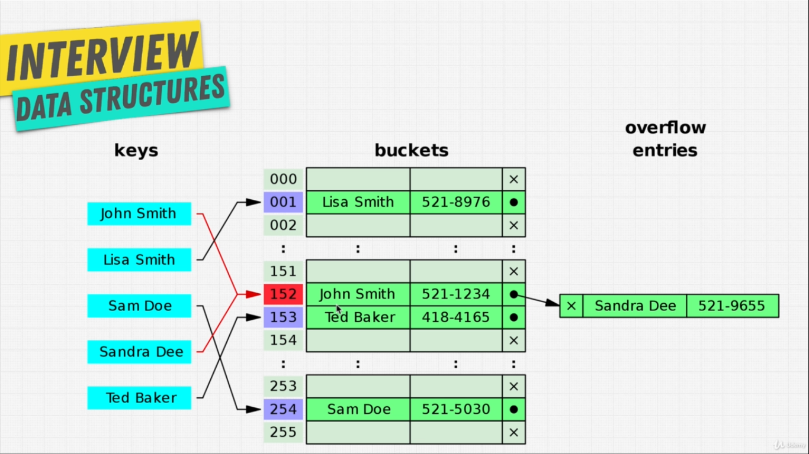
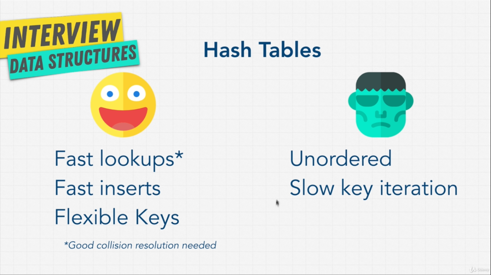
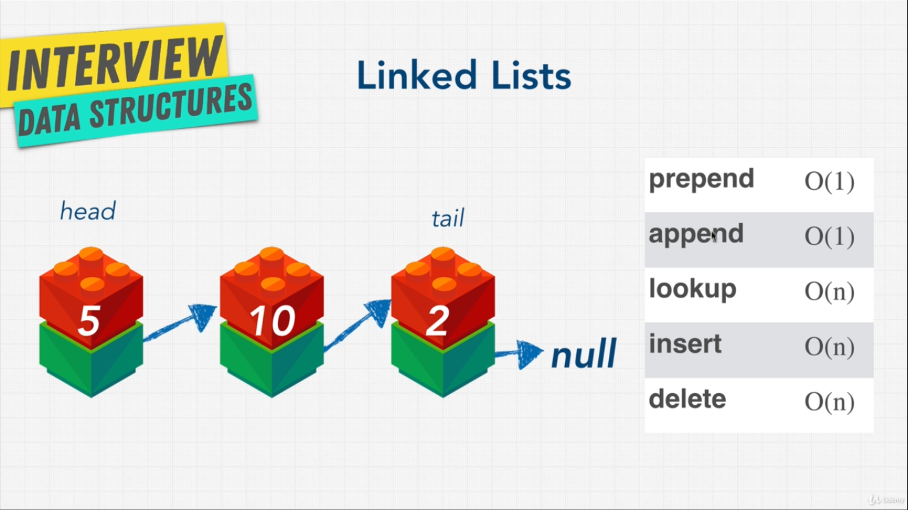
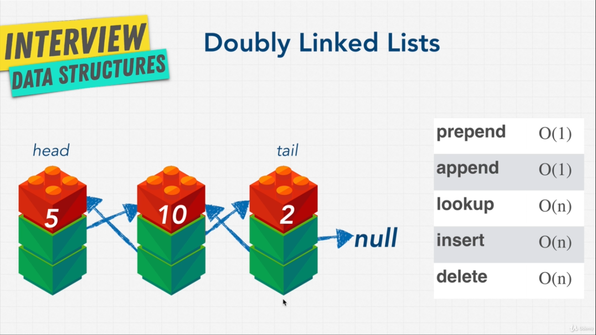

# Data Structures

Resources:

* [Glot](https://glot.io/)
* [Repl.it](https://replit.com/)

## Big O

**Resources:**
1. [BigOCheatSheet](https://www.bigocheatsheet.com/)

**Good Code:**\
Good code could be described in two points:
1. Readable
2. Scalable 
   1. Speed  (Time complexity)
   2. Memory (Space complexity)

Big o complexity chart:\
\
Simply put: When we grow big and big with our input, How much does our function/algorithm slow down.\
**Runtime**: How much time something takes to run.

### Different types of Big 0 notations

***Code Examples:***
* [Big O challanges](Codes_and_Assets/BigOchallange.js)
* [Big O Rules](Codes_and_Assets/BigORules.js)

**Rules:**
1. Worst Case
   * Big O only cares about the worst case scenerio. 
2. Remove constants
   * Constants play an insignificant role while n gets larger. So we don't count them
3. Different terms for input{Trickiest part}
   * Different inputs will have different numbers
   * The thing with O(a+b) and O(a*b)
4. Drop non Dominants
    * Where complexity is O(n + n^2), n^2 is the dominant one. So complexity will be O(n^2)

**O(n):**\
O(n) -> Big O of n -> Linear Time\
The Big O depends on the number of inputs.\
For loops or while loops.\
.png)\

**O(1):**\
O(1) -> Big O of 1 -> Constant time\
Does not depend on input size. Constant task.\
No loops\
.png)\

**O(n^2):**\
O(n^2) -> Quadratic time.\
Number of operations increases exponentially with the input size\
Nested loops{one inside another -> two}\
.png)\

**O(n!):**\
O(n!) -> Factorial time -> Oh no!\
Adding a nested loop for every single input

**Big O and algorithm:**\


### Space complexity

When a program executes, it has two ways to remember things. Heap and the stack.\
**Heap:** The variables we assign are stored here\
**Stack:** Where we keep track of our function calls.\
Space complexity elements:
1. Variables
2. Data structures
3. Function Calls
4. Allocations

## Coding problem solving skills

Companies are looking for:
1. Analytics Skills {How can you think through the problems and analyze them}
2. Coding skills  {Do you code well by writing simple, clean, organized, readable code}
3. Technical Skills  {Do you know the fundamentals of the job you are applying to}
4. Communication skills {Does your personality match the company culture}

### **Needed Knowledge**


### **Step By Step through a problem:**

1. When the interviewer says the question, write down the key points at the top (i.e. sorted
array). Make sure you have all the details. Show how organized you are.
2. Make sure you double check: What are the inputs? What are the outputs?
3. What is the most important value of the problem? Do you have time, and space and memory,
etc.. What is the main goal?
4. Don't be annoying and ask too many questions.
5. Start with the naive/brute force approach. First thing that comes into mind. It shows that
you’re able to think well and critically (you don't need to write this code, just speak about it).
6. Tell them why this approach is not the best (i.e. O(n^2) or higher, not readable, etc...)
7. Walk through your approach, comment things and see where you may be able to break things.
Any repetition, bottlenecks like O(N^2), or unnecessary work? Did you use all the information
the interviewer gave you? Bottleneck is the part of the code with the biggest Big O. Focus on
that. Sometimes this occurs with repeated work as well.
8. Before you start coding, walk through your code and write down the steps you are going to
follow.
9. Modularize your code from the very beginning. Break up your code into beautiful small pieces
and add just comments if you need to.
10. Start actually writing your code now. Keep in mind that the more you prepare and understand
what you need to code, the better the whiteboard will go. So never start a whiteboard
interview not being sure of how things are going to work out. That is a recipe for disaster.
Keep in mind: A lot of interviews ask questions that you won’t be able to fully answer on time.
So think: What can I show in order to show that I can do this and I am better than other
coders. Break things up in Functions (if you can’t remember a method, just make up a function
and you will at least have it there. Write something, and start with the easy part.
11. Think about error checks and how you can break this code. Never make assumptions about the
input. Assume people are trying to break your code and that Darth Vader is using your
function. How will you safeguard it? Always check for false inputs that you don’t want. Here is
a trick: Comment in the code, the checks that you want to do... write the function, then tell the
interviewer that you would write tests now to make your function fail (but you won't need to
actually write the tests).
12. Don’t use bad/confusing names like i and j. Write code that reads well.
13. Test your code: Check for no params, 0, undefined, null, massive arrays, async code, etc... Ask
the interviewer if we can make assumption about the code. Can you make the answer return
an error? Poke holes into your solution. Are you repeating yourself?
14. Finally talk to the interviewer where you would improve the code. Does it work? Are there
different approaches? Is it readable? What would you google to improve? How can
performance be improved? Possibly: Ask the interviewer what was the most interesting
solution you have seen to this problem
15. If your interviewer is happy with the solution, the interview usually ends here. It is also
common that the interviewer asks you extension questions, such as how you would handle the
problem if the whole input is too large to fit into memory, or if the input arrives as a stream.
This is a common follow-up question at Google, where they care a lot about scale. The answer
is usually a divide-and-conquer approach — perform distributed processing of the data and only
read certain chunks of the input from disk into memory, write the output back to disk and
combine them later.

### **Good code checklist:**

- [x] It works
- [x] Good use of data structures
- [x] Code Re-use/ Do Not Repeat Yourself
- [x] Modular - makes code more readable, maintainable and testable
- [x] Less than O(N^2). We want to avoid nested loops if we can since they are expensive. Two
separate loops are better than 2 nested loops
- [x] Low Space Complexity --> Recursion can cause stack overflow, copying of large arrays may
exceed memory of machine

### **Heurestics to ace the question:**

- [x] Hash Maps are usually the answer to improve Time Complexity
- [x] If it's a sorted array, use Binary tree to achieve O(log N). Divide and Conquer - Divide a data set
into smaller chunks and then repeating a process with a subset of data. Binary search is a great
example of this
- [x] Try Sorting your input
- [x] Hash tables and precomputed information (i.e. sorted) are some of the best ways to optimize your
code
- [x] Look at the Time vs Space tradeoff. Sometimes storing extra state in memory can help the time.
(Runtime)
- [x] If the interviewer is giving you advice/tips/hints. Follow them
- [x] Space time tradeoffs: Hastables usually solve this a lot of the times. You use more space, but you
can get a time optimization to the process. In programming, you often times can use up a little bit
more space to get faster time

**And always remember:** Communicate your thought process as much as possible. Don’t worry about
finishing it fast. Every part of the interview matters.

## Data Structures intro

**Resources:**
1. [List of all Data structures](https://en.wikipedia.org/wiki/List_of_data_structures)
2. 

Data structure: A collection of values having or not having relationships between them and functions applied to them.\
Variables are stored in RAM.

### Operations on Data structures

1. Insertion
2. Deletion
3. Traversal{Access each data at least once so that it can be processed}
4. Searching
5. Sorting
6. Access

## Arrays

**Codes:** 
1. [Array_1.js](Codes_and_Assets/Array_1.js)
2. [stringreverse.js](Codes_and_Assets/stringreverse.js)

**Classifications:**
1. Static   {Fixed in size. Need to specify the size while declared}
2. Dynamic  {Tricky static array: Copies elements to a new bigger location when about to overflow. Usually doubles the space}

### Big Os of Array Functions

1. Lookup -> O(1) -> Constant time
2. Push -> O(1)   -> Constant time
   1. Append -> O(1) but could be O(n) {This section is for dynamic array}
3. Insert -> O(n) -> Linear time
4. Delete -> O(n) -> Linear time



### Methods

```javascript
const arr = new Array(size)      // Uncommon style of instantiating an array
array[2]             // O(1)
array.push('value'); //adds 'value' to the end of array
                     // O(1) operation
array.pop();         //removes the last item from the array
                     // O(1) operation
array.unshift('value')  //Adds 'value' to the beginning of the array
// O(n) Because have to iterate through all the indexes and reassign them again
array.splice(2, 0, 'value')
// first param: Starting index, Second Parameter: Delete count, Third parameter: element to be added
// Adds an element at the specified position.
//O(n) because needs to shift the rest of the elements                   
```


### Others

* Contiguous memory: Sequencial memory addresses.
* Arrays are actually objects with integer based keys.
* Strings are actually array of characters.

## Hash Tables

**Useful Links amd codes:**
1. [MD5 Hash generator](http://www.miraclesalad.com/webtools/md5.php)
2. [hashTable.js](Codes_and_Assets/hashTables.js)
2. [hashTable2 .js](Codes_and_Assets/hashTables2.js)

Data with key-value pair. Difference with arrays: arrays use numbers as index.\
Keys in hash table stores{actually got by hashing} a memory address where the value could be found.\
*Hash tables are asked in interviews to improve time complexity*

**Time Complexity:**
1. Hashing -> converting key to index -> O(1) time complexity
2. Insert -> O(1)
3. lookup -> O(1)
4. delete -> O(1)
5. search -> O(1) 

**Issues with hash functions:**
* Hash collition {Because of memory shortage, same memory is allocated for multiple value}
* 
* While having collition, time complexity slows down to O(n/k) {K=size of hash table} -> O(n){removing constants}
  
**Javascript's Implementation of hash Table:**
1. ```Map()```
   1. In javascript object's key-value pair, keys are supposed to be strings. If number or function is passed as keys,\
      it gets stringified.
   2. ```const a = new Map()``` allows any data type as a key.
   3. It maintains insertion order. Objects do not maintain insertion order in the memory.
2. ```Set()```
   1. ```const a = new Set()``` Similar to ```Map()``` but only stores keys, no values.

**Overall Hash Pros & Cons:**\


## **Linked List**

**Useful Links and Codes:**
1. [linkedList.js](Codes_and_Assets/linkedList1.js)
2. [visualalgo.net](https://visualgo.net/en/list)

\
Each element of the linked list is called a node. A node has two parts of it, the value, the pointer to the next node.\
The first node is called Head and the last node is called tail. Link list is null terminated.\
The node pointing to null is called the tail.\
**Time Complexity of Linked Lists:**\
1. prepend{add node to the beginning of the list} -> O(1)
2. append{add node to the end of the list} -> O(1)
3. lookup{travarsal} -> O(n)
4. insert -> O(n)
5. delete -> O(n)

**Pointers:** Pointers are reference to a specific place in the memory.\

### **Doubly Linked List:**

A Doubly linked list has three parts.\
One holds value, other one holds reference to the next node, and the last holds reference to the previous node.\
This structure lets a linked list to be travarsed from backwards.\


## **Stacks and Queues**

* Linear data structures -> Go through data elements sequentially one by one while only one data element could be directly reached.
* Main difference in only how things get removed
* No random access operation

### **Stacks**

* One data stacked on top of anoter data vertically.
* Only can access the top data
* ***LIFO:*** **L**ast **I**n **F**irst **O**ut

**Time Complexity:**
* Lookup -> O(n)
* pop -> O(1)
* push -> O(1)
* peek -> O(1) {peek means lookup the top element }

### **Queues**

* ***FIFO:*** **F**irst **I**n **F**irst **O**ut

**Time Complexity:**
* Lookup -> O(n)
* Enqueue -> O(1) {Enqueue is similar to push}
* Dequeue -> O(1) {Dequeue is similar to pop but from the top}
* Peek -> O(1)