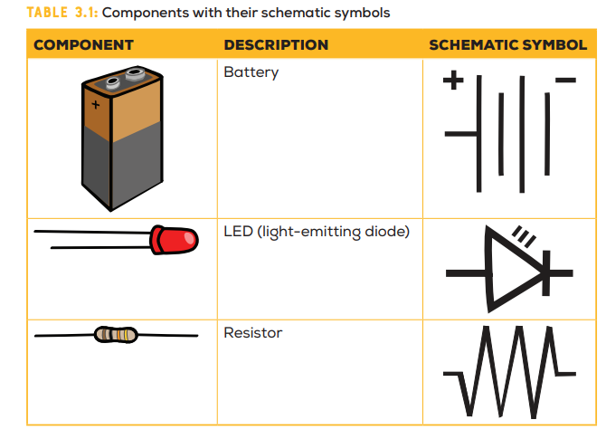
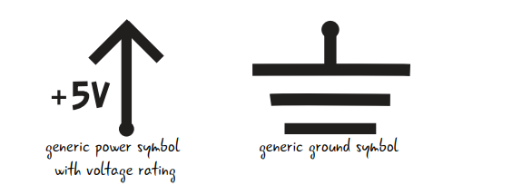
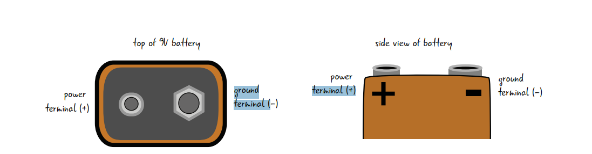

# Notes on arduino and basic electronics

[Electronics symbols wikipedia](https://en.wikipedia.org/?title=Electronic_symbol)

## Component Schematic Symbols




## Electronic components in general

- The cable with arduino is called usb a-b cable
- **PCB** Printed circuit boards
- **Schematic:** Way to represent the electrical relationships in a circuit.
- LED's Positive lead: Anode, Negative lead: Cathode
- Other component's positive connects to battery positive and negative to battery negative
- Power Supply color convention: Red (+), Black (-)
- 

## Resistors

- No idea? 330ohm ones to use with LEDs

### **Resistor Color Code**

**Mnemonic:**

| Mnemonic   | Color      | Number |
| ---------- | ---------- | ------ |
| **B**etter | **B**lack  | 0      |
| **B**e     | **B**rown  | 1      |
| **R**eady  | **R**ed    | 2      |
| **O**r     | **O**range | 3      |
| **Y**our   | **Y**ellow | 4      |
| **G**reat  | **G**reen  | 5      |
| **B**ig    | **B**lue   | 6      |
| **P**lan   | **P**urple | 7      |
| **G**oes   | **G**ray   | 8      |
| **W**rong  | **W**hite  | 9      |

| Color  | Tolerance |
| ------ | --------- |
| Gold   | 5%        |
| Silver | 10%       |

Three color resistors:

1. First color: first number.
2. Second color: second number.
3. Third color: number of zeros.
4. Fourth color: percentange of tolerance. 20% if not mentioned

- **ex:** Brown--Black--Green Striped resistor's resistance is 1--0--00000 ohm
- **ex:** Yellow--Purple--Red Striped resistor's resistance is 4--7--00 ohm
- **ex:** Purple--Green--Black Striped resistor's resistance is 7--5-- ohm
- **ex:** Yellow--Purple--Orange Striped resistor's resistance is 4--7--000 ohm

Exceptional three color resistors:

1. First color: first number
2. Second color: second number
3. Third color: usually gold/silver.
   1. Gold: Move the decimal point one place to the left.
   2. Silver: Move the decimal point to two place to the left

Four Color Resistors

1. First color: first number
2. Second color: second number
3. Third color: third number
4. Fourth color: number of zeros
5. Fifth color: percentange of tolerance. 20% if not mentioned.
6.

- **ex:** Red--Red--Black--Orange--Brown Striped resistor's resistance is 2--2--0--000--1%
- **ex:** Blue--Grey--Black--Brown--Brown Striped resistor's resistance is 6--8--0--1--1%

## Basic Coding Syntaxes

```c++
#include <Arduino.h>    // For including the arduino library in PlatformIO

void setup(){
   // Setup codes go here
}
void loop(){
   // Will execute code over and over
}
```

### `pinMode`

Determines how the pin should behave

```c++
pinMode(PIN_NUMBER, PIN_TYPE); //Pin type is either INPUT or OUTPUT
```

### `digitalWrite`

Controls digital signal to a pin

```c++
digitalWrite(PIN_NUMBER, SIGNAL_TYPE); //Signal Type is either high or low
```

## Serial Monitor

```c++
Serial.begin(9600); // Need to put this inside setup. Starts Serial monitor
Serial.print("Things to print");  // Prints to serial monitor. Not new line at the end
Serial.println("Things to print"); // Prints to serial monitor. A new line is inserted afterwards
if(Serial.available() > 0){
   variable = Serial.read(); // will read data from the serial monitor
}
```

## PlatformIO.ini specific stuffs

- `monitor_speed = 9600` will set the serial monitor speed

## Circuit Debugging Checklist

1. Power and Ground connection
2. Correct orientation of the components
3. Checking the resistors
4. Check the breadboard tie points to find out connection errors. Circuit continuity is the main word to say here.
