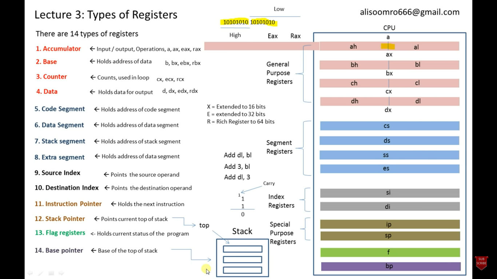
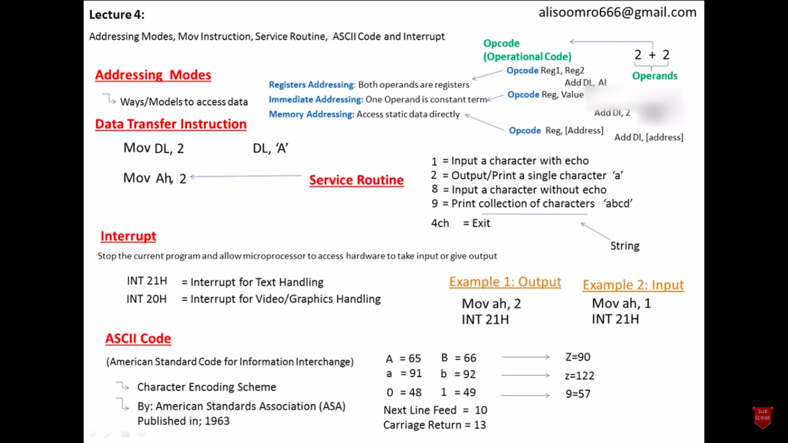
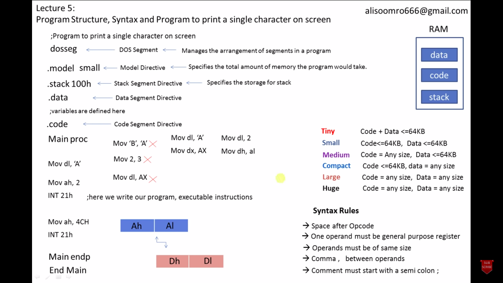
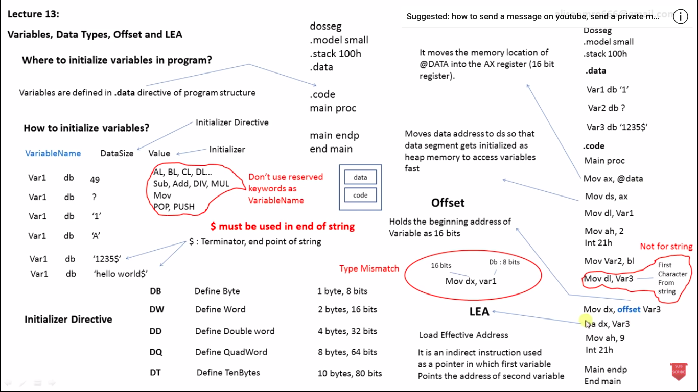
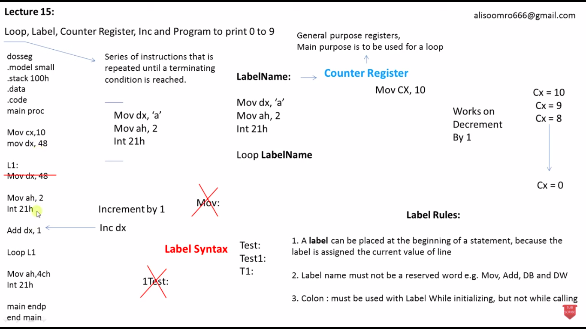
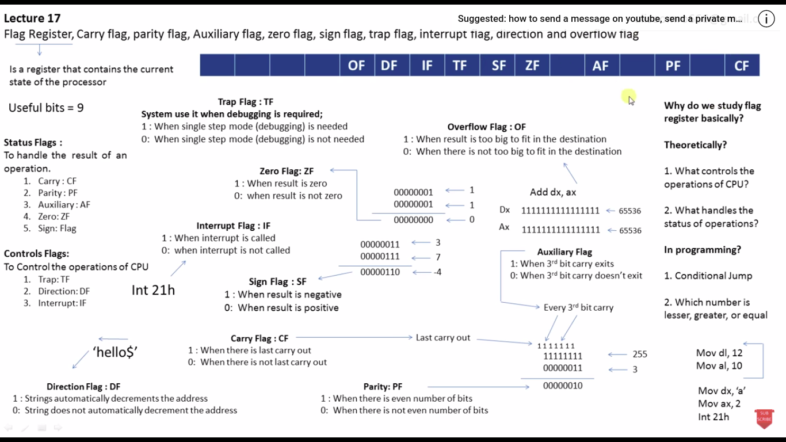
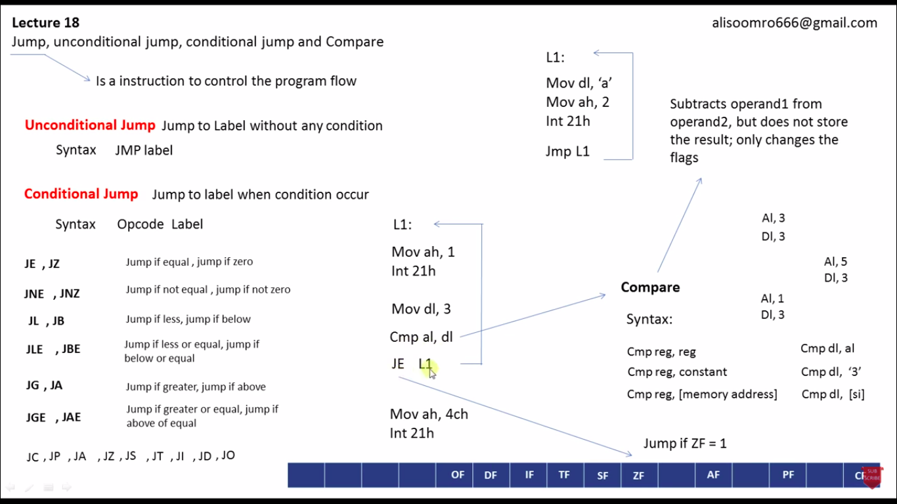
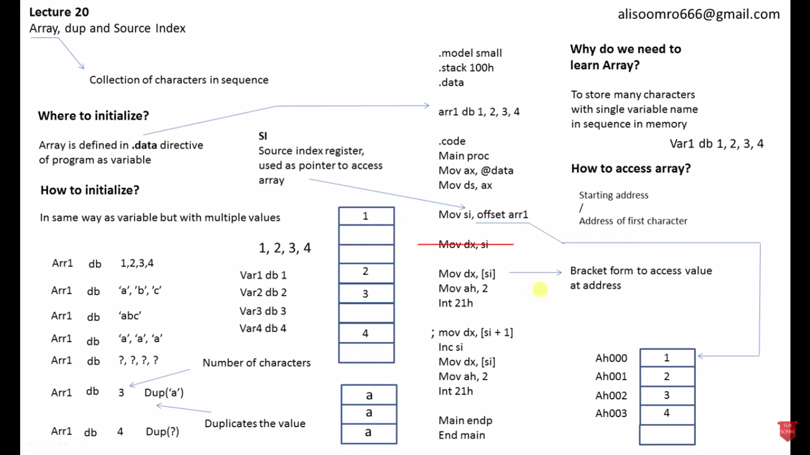
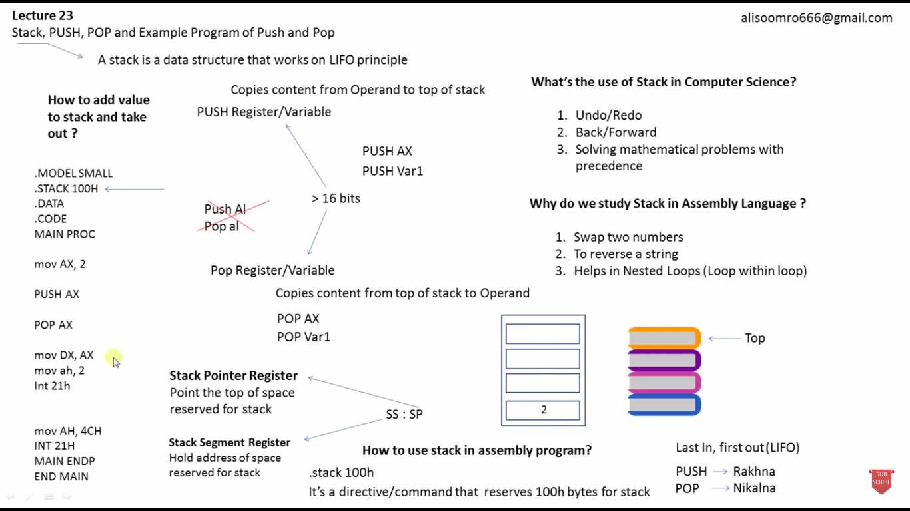

# Notes on Assembly language

This language was designed by David John Wheeler
What is assembly language?\

1. A computer programming language
2. Low level language(close to the hardware)

Why learn Assembly?\

1. Better understanding of software and hardware interaction.
2. Optimization of processing time.
3. Embedded programming

## High level language convertion process

|                                       |           |
| ------------------------------------- | --------- |
| High Level Language (.c)              |           |
|                                       | Compiler  |
| Assemlby Code (.asm)                  |           |
|                                       | Assembler |
| Object File(.o){contains source code} |           |
|                                       | Linker    |
| Machine code                          |           |

Linker links the object files together and links the libraries(if necessary) and then converts itself to binary code.\
Assembly language reduces the process of compiling which makes itself faster

## Registers

Registers:Record or collection of information.\
What are registers?

1. Registers are memory cells built inside CPU.
2. Fastest storage area/location
3. Quickly accessible by CPU as these guys are built inside CPU

**Diagram:**

|           |     |       | CPU      |
| --------- | --- | ----- | -------- |
| Hard Disk | RAM | Cache | Register |

Closeness to the cpu decides the file transfer speed. Assembly language lets us to access the cpu registers.

### Types of registers

There are 14 types registers inside a CPU:



## Addressing Modes, MOV instruction, Service routine, ASCII code, Interrupt


**Correction**\
a=97 and b=98\
INT 10H is for graphics\
Carriage return is the code of "Enter Key"

## Program structure, Syntax, Program to print a single character on screen



## Dosbox commands

1. Edit filename.asm
2. MASM filename.asm; => semicolon for not showing the log in the screen
3. LINK filename.obj;
4. filename.exe

## Character input

```assembly
    mov ah,1    ;moving 1 in accumulator means input will be saved in al portion of the register
    int 21h

    mov dl,al   ;register addressing -> moving the inputted value inside data register
```

## ADD operation

```assembly
    mov bl,2    ;moving values to a general purpose registers
    mov cl,3    

    add bl,cl   ;here, bl is the destination register and cl is the source register
                ;cl won't change its value, but bl will hold the result of addition of the bl,cl
    add bl,48   ;ASCII 0=48, bl+48 will generate the ascii value of the result and put it into bl

    mov dl,bl   ;moving the answer to data register
```

## SUB operation

```assembly
    mov bl,9    ;moving values to a general purpose registers
    mov cl,1
    sub bl,cl   ;here, bl is the destination register and cl is the source register
```

## Variables



## Strings

```assembly
    mov ax,@data            ;moving address of data segment in accumulator ax(16 bit)
    mov ds,ax               ;moving ax inside data segment register => initiallizes a heap memory

    ;mov dx,offset msg1      ;moving string address into dx(16 bit){addresses are in 16 bit}
    lea dx,msg1             ;load effective address dx to msg1
```

## Loop, Label, Counter Register, Inc, Program to print 0 to 1



```assembly
    mov cx,26       ;Setting the counter register
    mov dx,65       
    loopingLabel:
        mov ah,2
        int 21h 
        
        add dx,1    ;incrementing the dx register value
        ;inc dx     ;increments dx by 1
    loop loopingLabel
```

## Flag Register Carry parity Auxiliary zero sign trap interrupt direction and overflow flag



## Jump



## Array



## Push and Pop, Stack


