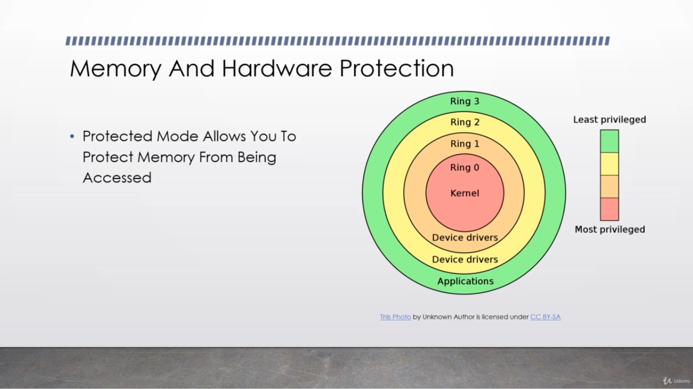

# abrarOS Learnings for future use

**Important link:** \
[Robert Brown's Interrupt list](http://ctyme.com/rbrown.htm)\
[Exception Handling](https://wiki.osdev.org/Exceptions)

## The BIOS

The Bios is almost a kernel in itself.

1. The CPU executes instructions directly from BIOS's ROM.
2. The BIOS generally loads itself into the RAM.
3. The BIOS will initialize essential hardware.
4. BIOS looks all storage medium for boot loader. It searches for the boot signature 0x55AA
    The 511th and 512th byte should contain a boot signature.
5. If it finds that signature, it will load the sector into the 0x7C00 section of the memory and start execution process from there.

## The BIOS parameter Block

[Bios Parameter Block Wiki](https://wiki.osdev.org/FAT)\
Some BIOSs write data in the first 33 bytes. So better not to put any code there. It's safe to fill them with zeros

## The Boot Loader

The Boot Loader is a small program responsible for loading the kernel of an operating system.\
In Real Mode(Real mode is a compatibility mode), Boot loader is given only 1MB of memory. It also runs on 16 bit code.\
MB is not so much space to do anything. So, boot loader's responsibility is to put into protected mode.\
Protected mode has access to 4GB of memory.\
**In Short:** Boot Loader's job is to put the kernel into the memory. Switches the processor into 32 bit protected mode. Then executing the kernel.

## The Boot System

1. BIOS is executed directly from the ROM
2. The BIOS loads the boot loader into address 0x7C00
3. The Boot loader loads the kernel
4. The kernel loads the essential pieces of the operating system

## The Real mode

1. Real mode is a compatibility mode which is started when all intel processors are switched on
2. In Real mode, only 1MB of memory could be accessed.
3. There is no security in real mode. No security for memory or hardware
4. In this mode, Memory is accessed through segmentation memory model
5. All code should be made in 16 bit architecture style

## NASM commands

**```nasm -f bin ./boot.asm -o ./boot.bin```**\
```-f bin``` means we are assembling to headless binary file(no object file in the middle-> object files has headers)\
**```ndisasm ./file.bin```**\
disassembles a binary file

## QEMU commands

**```qumu-system-x86_64 -hda file.bin```**\
```-hda``` for specifying the hard drive\

## Segmentation memory model

1. Memory is accessed by a segment and an offset
2. Multiple segments are available through the use of segment registers
3. The segment registers:\
    ```CS``` -> code segment register\
    ```SS``` -> stack segment register\
    ```DS``` -> data segment register\
    ```ES``` -> extra segment

**Calculation of actual memory from segmentation model:** Multiply te segment by 16 and then add the offset with it

## Disk Access

Disk itself has no concept of files. It's the responsibility of the kernel to read the files from the data structure of them.\
**Data Sectors:** Data is typically written in sectors typically of 512 byte blocks

### LBA & CHS

CHS is the old system of loading data. Will be using LBA for the most time.\
**LBA:** Logical Block Address. This method allows us to read disk from the number zero. EX: LBA0, LBA1, LBAn is the nth sector of the disk.\
**Calculating LBA:** LBA = (Byte Address / 512) ---------- Offset = (Byte Address % 512)\
For real mode, BIOS has interrupt 0x13 for disk operations.\
But for 32 bit protected mode, We have to create owr own disk driver

## Protected Mode in Detail

Protected mode is a processor state in x86 architecture which gives access to memory protection, 4GB address space and much more.\

1. Protected mode can provide hardware and memory protection
2. It's got different memory schemes
3. 4GB of memory is directly addressable

**Memory protection:**\

Protected mode allows memory from being accessed, Protected mode can prevent user program talking with hardware