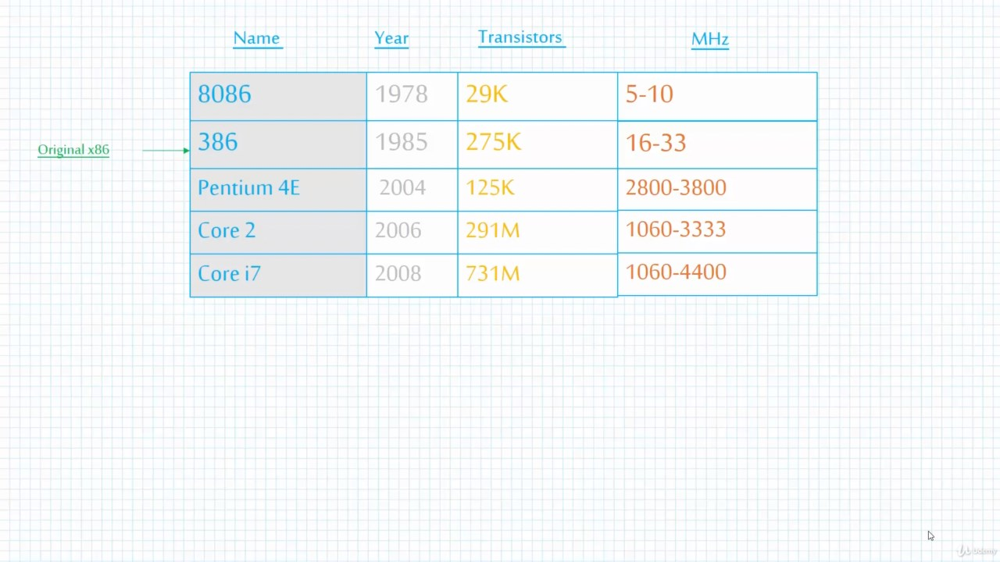
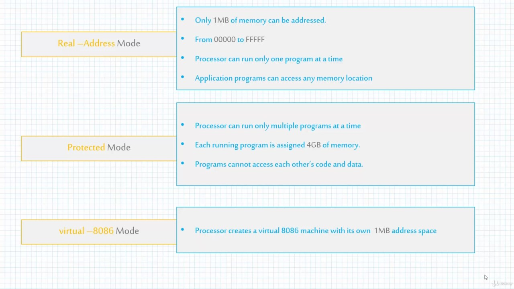
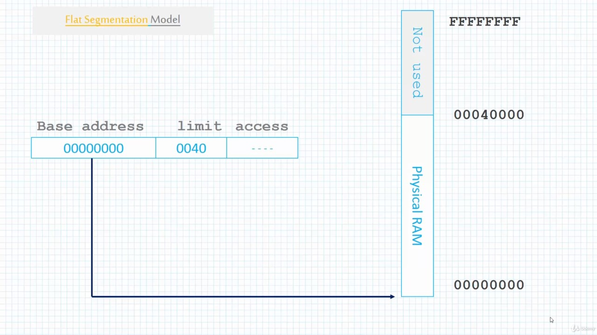
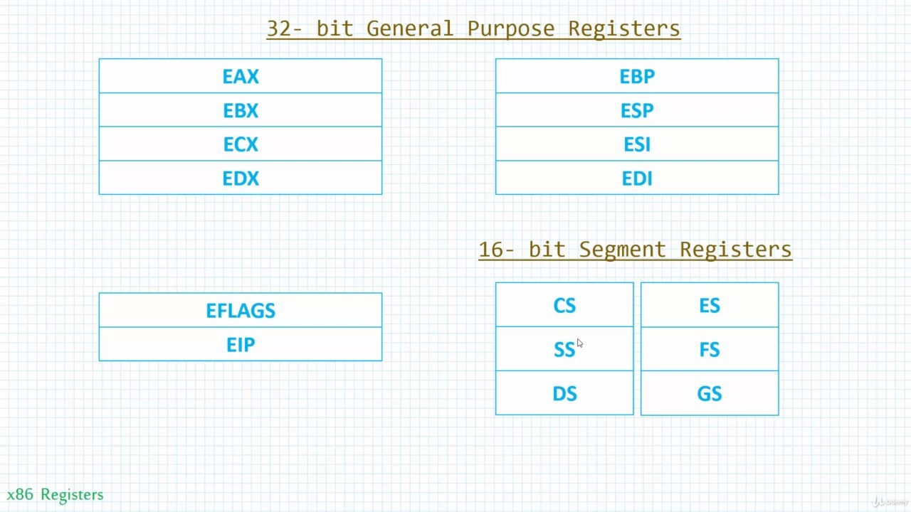
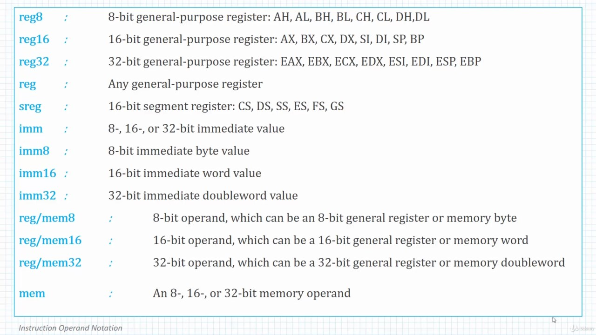
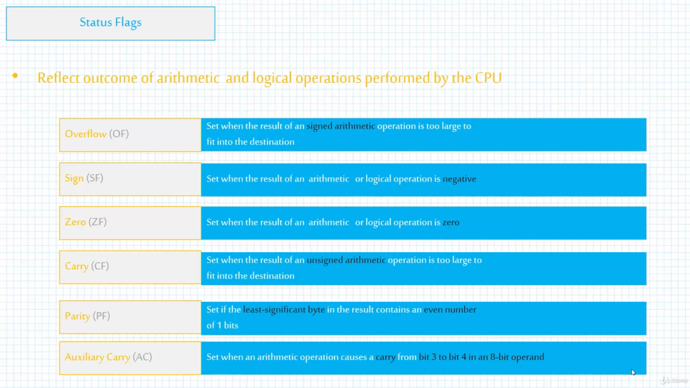
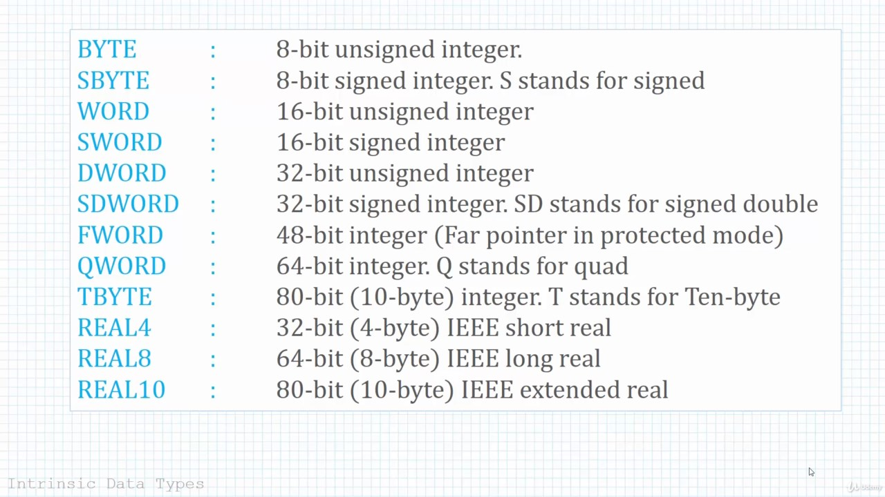

# Assembly for modern x86 processors

## Evolution of intel processors



## x86 Data Types

1. **byte:** 8bit   -> 2^8-1
2. **word:** 16bit  -> 2^16-1
3. **dword:** 32bit (doubleword)    -> 2^32-1
4. **qword:** 64bit (quadword)  -> 2^64-1

**Variable declaration type:**\
(+/-) digits radix\
**Different Type of Radix:**

1. H->Hexadecimal
2. r->Encoded Real
3. q/o->Octal
4. t->Decimal
5. d->Decimal
6. y->Binary
7. b->Binary

## Memory models



### Real-Address mode

Memory is divided into segments and offsets\
Program has three segments:

1. code (CS register holds the address of the code segment)
2. data (DS register holds the address of the data segment)
3. stack (SS register holds the address of the stack segment)

Addresses are dword/16 bit values

### Protected-Address Mode

4GB linear address space is available\
Program segments:

1. code (CS references to the code-segment descriptor table)
2. data (DS references to the data-segment descriptor table)
3. stack (SS references to the stack-segment descriptor table)

Protected addressing mode uses flat segmentation model


## Operating modes of a x86 processor

1. Protected Mode
2. Real-Address Mode
3. System Management Mode

## x86 Registers

A register is a storage inside a processor core which could be accessed at much higher speed than conventional memory\
Registers in x86 processors:\


The index registers of 16 bit old registers are called Specalized registers here

## x86 Flags



## Directives or Pseudo-ops

Directives are not a part of instruction sets. They are there only to assist the assembly process\
They change the way how code is assembled.\
**Some Directives:**\

1. .CODE - Indecates the start of the code segment
2. .DATA - Indecates the start of the data segment
3. .STACK - Indecates the start of the stack segment
4. .END - Marks the end of a module
5. .DD - Allocate a double word(4bytes) storage
6. .DWORD - Allocate a double word(4bytes)

## Instructions

A statement that becomes executable when a program is assembled\
**Syntax:** ```mnemonic operand1, operand2, operand3,...```

## Lables

Used as a place marker for instructions and data

## Variables



```assembly
;strings
hello Byte "Hello World", 0
;the 0 at the last represents null terminator
```

## Endianness (Little Endian Method)

Least significant byte is stored in the first address and Most significant byte is stored in the second address.\
For 12345678h will be saved in the memory like:\

| Offset | Value |
| ------ | ----- |
| 0000   | 78    |
| 0001   | 56    |
| 0002   | 34    |
| 0003   | 12    |

## Mov instruction & MOVZX/MOVSX instruction

```movzx``` is used to mov data of lower size into the higher byte sized registers

```assembly
;it's something like
mov ax, 44h
mov ebx, ax ;doesn't work perfectly because ebx is 32bit and the higher bits are not always zeros
;to make the higher bits zero,
movzx ebx, ax ;is used
```

```movsx``` uses in the similar way but it fills the upper bits with 1 instead of zero

## Data Operators and directives

1. **OFFSET:** Returns offset of a data label. Distance of the data label from the beginning of the data label
2. **PTR:** Overrides the operand's default size
3. **TYPE:** Returns size of operand or array element size
4. **LENGTHOF:** Returns the number of elements inside an array
5. **SIZEOF:** Returns the numbers of bytes used by an array initializer
6. **LABEL:** Redefines the same variable with different size attributes
7. **ALIGN:** Aligns a variable on a boundary
