# CSS

## Basics

```css
* {
  margin: 0; /* removes the default margin provided by the browser */
  padding: 0; /* removes the default padding provided by the browser */
}
```

## **`display` property:**

[Code example](https://codepen.io/abrar-nazib/pen/rNpXMYb)

**block:**

- A block level element always starts on a new line and takes up the full width available.
- div, h1-h6, p, form, header, footer, sections are block level element.

```css
elemnt {
  display: block;
}
/* ------------------------------------------------------------------
   |            Element                                             |
   ------------------------------------------------------------------
*/
```

**inline:**

- An inline element does not start on a new line and only takes the only space necessary
- span, a, img are inline elements

```css
element {
  display: inline;
}
/* ------------------------------   ------------------------------------
   |            Element 1        | |             Element 2              |
   ------------------------------   ------------------------------------
*/
```

**inline-block:**

- Difference with inline is that it allows to set a width and height on the element.

**none:**

- Hides an element without deleting it.
- Other elements take the place of the hidden element.
  - Using `visibility: hidden`, other elements do not take the place of hidden element.

```css
element {
  display: none;
}
/* The element gets hidden */
```

**Inherit:**

- inherits the display property of the parent

## Margin

```css
element {
  margin: auto; /* puts the element in the dead centre of the parent element {by x axis} */
}
```

## Box model in css3

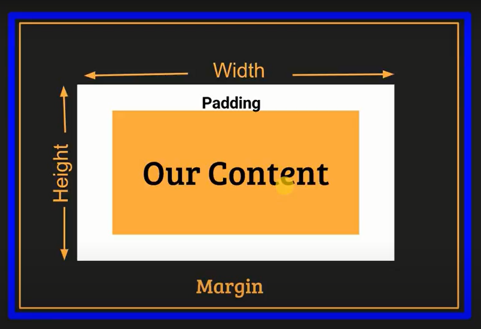
[Codepen link](https://codepen.io/abrar-nazib/pen/RwxzvKy)

- Width = Actual width + Left Margin + Right Margin + Left padding + right padding
- Padding: Considered to be part of the element.
- Margin: Vertical margins collapse

## Box sizing

[Code link](https://codepen.io/abrar-nazib/pen/yLpmYpo?editors=0100)

**Border-box:**

- Width = Actual width which was set using `width: $width`.

```css
element {
  box-sizing: border-box;
}
* {
  box-sizing: border-box; /* For implementing globally */
}
```

**Content-box:**

- default box sizing.

**Inherit:**

- The child element will inherit the box sizing of the parent div.

## Position property

**`static`:**

- The default positioning property of any element.

**`fixed`:**

- Won't move with the rest of the elements while scrolled.
- `top: 100px` with fixed property means the element will be 100px away from top. {`right, left, bottom` are also available}
- positioned relative to the viewport

**`relative`:**

- Relative to the static position.
- Setting the top, right, bottom, and left properties of a relatively-positioned element will cause it to be adjusted away from its normal position. Other content will not be adjusted to fit into any gap left by the element

**`absolute`:**

- Relative to the nearest ancestor element.
- Parent of this element has to have an absolute or relative property.
  - If no parent element is given, html document will be the parent element.
- `top, left, right, bottm` gaps are measured according to the parent element.

```css
element {
  position: absolute;
}
```

**`sticky`:**

-It is positioned relative until a given offset position is met in the viewport - then it "sticks" in place (like position:fixed).

## Transform

```css
element {
  transform: rotate(45deg); /* rotate the object 4g degree clockwise */
}
```

## Pseudo Classes

```css
element::before {
  content: ""; /* A content is must have in pseudo classes */
  display: block; /* Div elements are easy to use if they're block */
}
```

## Float

-Float is used to create the layout/architecture of a website.

```css
element {
  float: left; /* right also works */
}

otherElement {
  clear: both; /* Needs to be done because otherwise hovers on the div */
}

.clearfix::after {
  /* have to apply this in the parent element */
  content: "";
  display: block;
  clear: both;
}
```

## Flexbox

```css
container {
  display: flex; /* to give superpowers to the html document */
  /* the container becomes flex container and the elements inside it becomes flex content */
}
```

**Axis:**

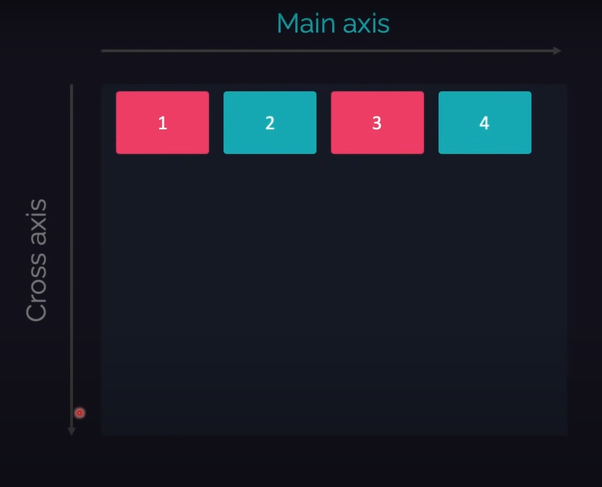

**Flex direction:**

- `flex-directoin: row` by default row. Left to right
  - Contents follow the main axis
- `flex-direction: row-reverse` reverses the direction of the flex elements. Right to left
- `flex-direction: column` swaps the main axis with the cross axis. Up to down.
- `flex-direction: column-reverse` for reversing column alignment. Down to up.

**Flex wrap:**

Wrapping: Starting from beginning without overflowing.

- `flex-wrap: nowrap` Will overflow. Won't wrap.
- `flex-wrap: wrap` will wrap the internal components.
- `flex-wrap: wrap-reverse` will wrap from the bottom->left-to-right then one line up left-to-right

**Flex flow:**

- `flex-flow: [flex-direction] [flex-wrap]` Third bracket not needed.

**Justify-content:**

- by default justify content is sticking to the left margin.
- it's `justify-content: flex-start`
  - 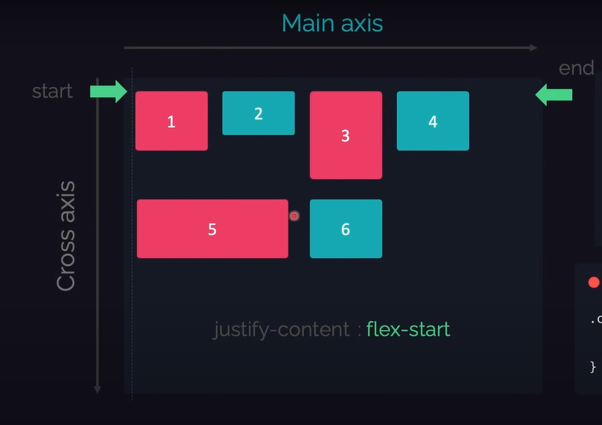
- `justify-content: flex-end` uses the right margin to stick.
  - 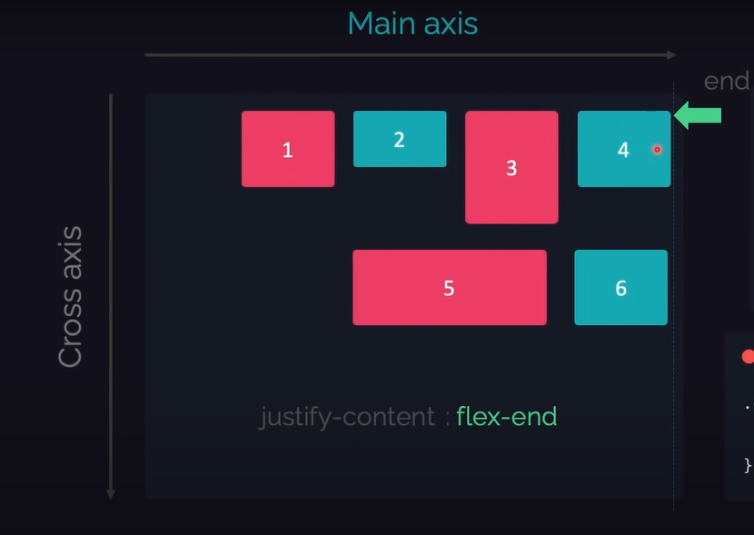
- `justify-content: center` centers the content by x axis.
- `justify-content: space-around` In the main axis, elemnts equally take up the space to themselves.
  - 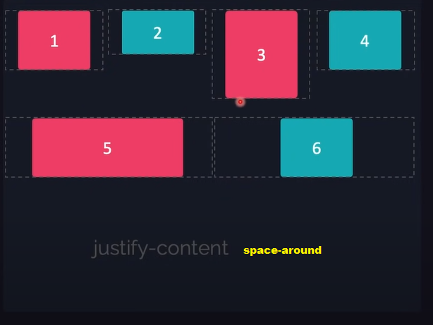
- `justify-content: space-between` Gives them uniform space between two elements.
  - 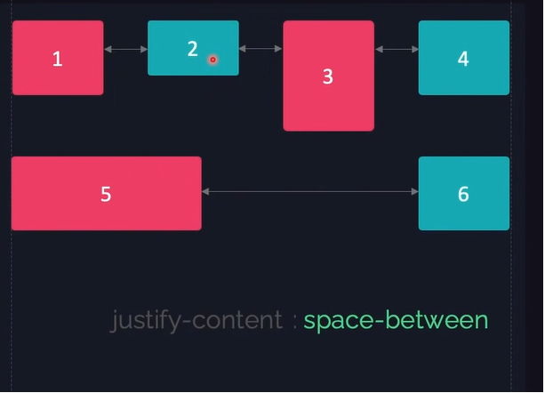
- `justify-content: space-evenly` The value of the space will be equal between elements.
  - 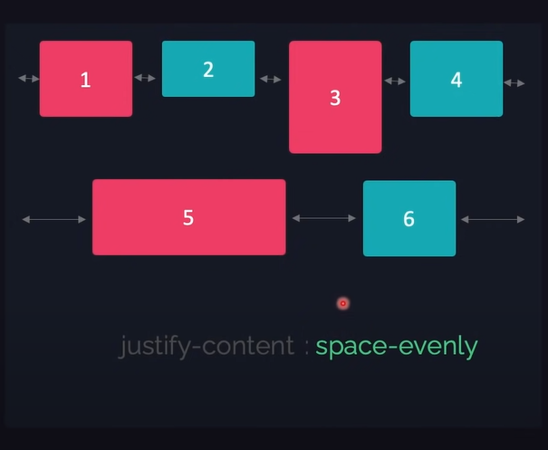

**Align-items:**

Justify content but movement in cross axis. Unlike content, modification behavior is item centric
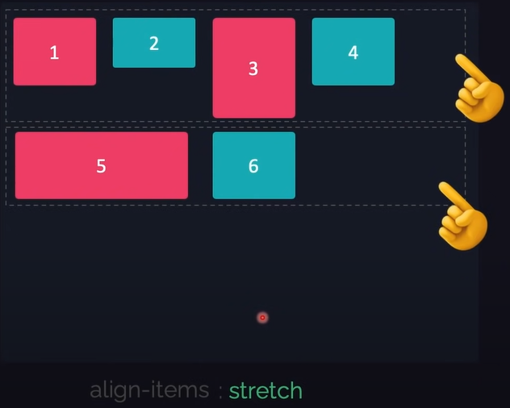

- `align-items: strech` default behavior. Stretches the elements in the cross axis if fixed height is not given.
  - 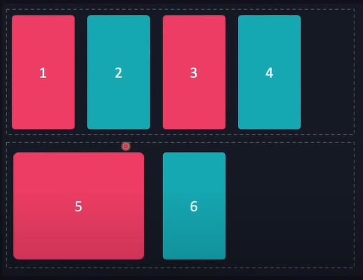
- `align-itmes: flex-start` Won't stretch. Will have the value needed. Sticky to main axis{top one}.
  - 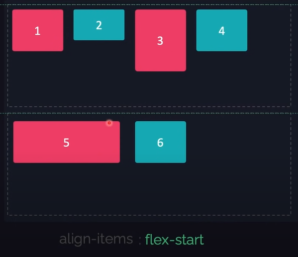
- `align-items: flex-end` opposite of flex-start. Sticky to main axis{bottom one}
  - 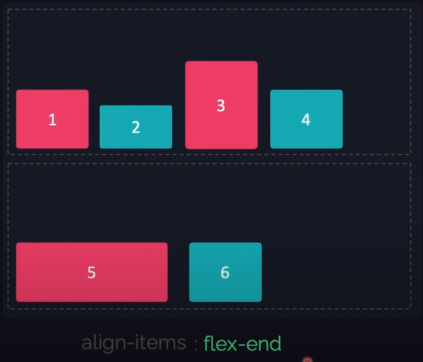
- `aligh-items: center` Center by the y axis.
  - 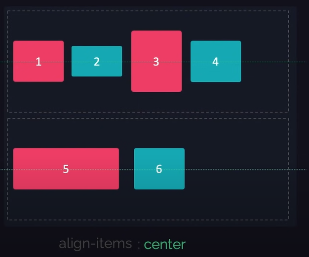

**Aligh-items when flex-direction Column:**

- 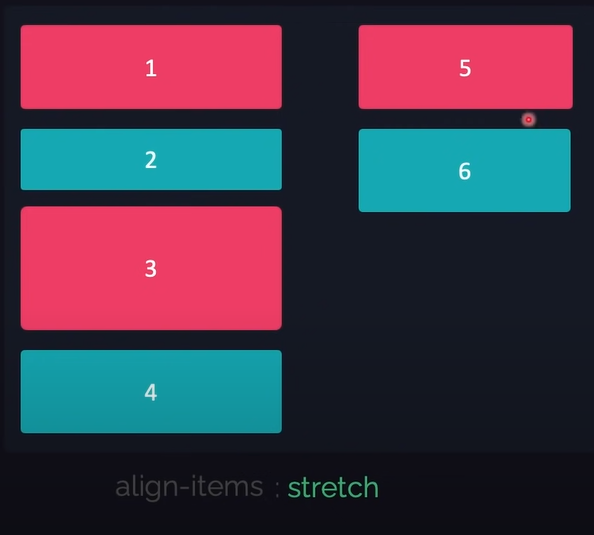
- 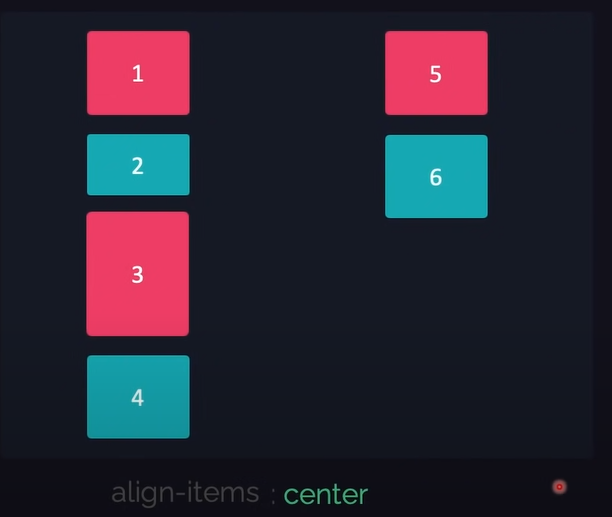
- 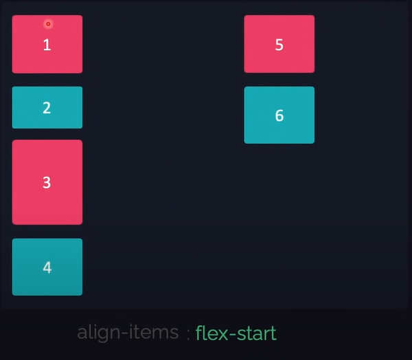
