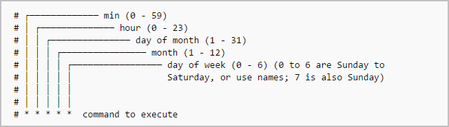

# Notes on experience gained through playing ctf

## **Useful CTF website link:**\

- [OvertheWire](https://overthewire.org/wargames/)
- [SmashTheStack](http://smashthestack.org/)
- [exploit.education](https://exploit.education/)
- [TryHackMe](https://tryhackme.com)
- [HackTheBox](https://www.hackthebox.eu/)
- [CryptoPals](https://cryptopals.com/)
- [CryptoHack](https://cryptohack.org/)
- [MicroCorruption]()
- [Lord of SQL injection]()
- [Vulnhub]()

## Note Template

- Reconnaissance
- Enumeration/Scanning
- Gaining Access
- Privilege Escalation
- Covering Tracks
- Reporting

## Recon Tools and website links

- Google (specifically Google Dorking)
- Wikipedia
- PeopleFinder.com
- who.is
- sublist3r
- hunter.io
- builtwith.com
- wappalyzer

## Enumeration or Scanning tools

Enumeration is done for understanding the attack surface of the target

- [`nmap`](../tools/Nmap/README.md)
- [`rustscan`](../tools/Rustcan/README.md)
- [`gobuster`](../tools/Gobuster/README.MD)

## Privilage Escalation methodology

- Cracking password hashes found on the target
- Finding a vulnerable service or version of a service which will allow you to escalate privilege THROUGH the service
- Password spraying of previously discovered credentials (password re-use)
- Using default credentials
- Finding secret keys or SSH keys stored on a device which will allow pivoting to another machine
- Running scripts or commands to enumerate system settings like 'ifconfig' to find network settings, or the command 'find / -perm
  -4000 -type f 2>/dev/null' to see if the user has access to any commands they can run as root

## Reporting

[Demo Security assessment report](https://github.com/hmaverickadams/TCM-Security-Sample-Pentest-Report)

- The Finding(s) or Vulnerabilities
- The CRITICALITY of the Finding
- A description or brief overview of how the finding was discovered
- Remediation recommendations to resolve the finding

**Demo:**

- **Finding**: SQL Injection in ID Parameter of Cats Page
- **Criticality**: Critical
- **Description**: Placing a payload of 1' OR '1'='1 into the ID parameter of the website allowed the viewing of all cat names in the cat Table of the database. Furthermore, a UNION SELECT SQL statement allowed the attacker to view all usernames and passwords stored in the Accounts table.
- **Remediation** Recommendation: Utilize a Prepared SQL statement to prevent SQL injection attacks

## Brute-force and Hash cracking

[Hydra](../tools/Hydra/README.md)

## Cron jobs

- `crontab -l` shows the current cron jobs
- `crontab -e` edits the current user's cron jobs file
- `crontab -u username -e` shows the cron jobs for specified user

/etc/crontab check for cron files
