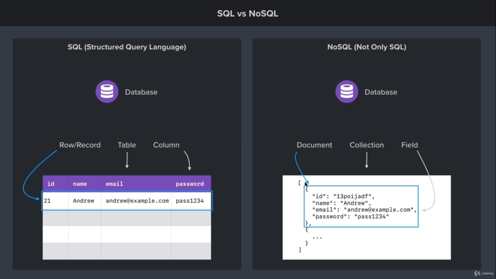

# Mongodb Nosql

## Normal Stuffs

- Runs on port 27017 by default

## Differences with SQL databases

- In Sql database, data is stored as list which is called table. In NoSql, data is stored as collection.
- In sql database, a row is a record. Equivalent dataset in nosql is called document.
- The thing column in a sql database is called Field in nosql.
  

## Terminal Commands

- `path/to/bin/mongod --dbpath=/path/to/db/folder` to start mongodb server in port 27017
- `db.version()` in robo3t terminal, shows mongodb version

## Mongodb Drivers

- [Mongodb Nodejs Drivers](https://mongodb.github.io/node-mongodb-native/4.2/)
- [Documentation](https://www.mongodb.com/docs/drivers/node/current/)
- Drivers are those libraries which allow mongodb to interact with other programming languages.

## Connecting and setup mongodb server

[Connection guide](https://www.mongodb.com/docs/drivers/node/current/fundamentals/connection/)\

```javascript
const mongodb = require('mongodb');   // Could be replaced with const {MongoClient} = require('mongodb') }}} usage of destructuring
const MongoClient = mongodb.MongoClient;
  // Mongoclient will provide function necessary to connect to database.
const connectionURL = 'mongodb://127.0.0.1:27017';
const databaseName = 'databaseName'

MongoClient.connect(connectionUrl, {useNewUrlParser: ture}, (error, client)=>{
  /*callback function*/
  // The callback function will get called when the database connection is successful.
    // The callback function gets called with either an error or an client.
  // The option useNewUrlParser is there to instruct the parser to parse the url correctly
    if(error)//If error is not Null
    {
      //do whatever needed to be done with the error
      return logger("error message");
    }
    db = client.db(databaseName); 
      // Will create a database if database not create already. If created will get a reference to the database.
});

```

Whenever mongodb is connected, it connects via connection pool. So more than one connection is going on in the behind.

## CRUD

- **C**reate, **R**ead, **U**pdate, **D**elete

## `find, findOne`

Finds a document according to the key-value pair match.

```javascript
db.collection(collectionName).findOne({ key: "value" }, (error, rusult) => {
  /*callback handler*/
});
// while finding with _id, be cautious
db.collection(collectionName).findOne(
  { _id: new ObjectId("5ea3a21a1a1aa1a1a1a1a1a1") },
  (error, result) => {
    /*callback handler*/
  }
);
// Find does not have any callback function. It returns a cursor
db.collection(collectionName)
  .find({ key: "value" })
  .toArray((error, result) => {
    /*callback handler, result holds search result*/
  });
db.collection(collectionName)
  .find({ key: "value" })
  .count((error, result) => {
    /*callback handler, count holds how many results returned*/
  });
```

## Insertion of data: `insertOne, insertMany`

[Doc](https://www.mongodb.com/docs/drivers/node/v4.0/usage-examples/insert-operations/)

```javascript
db.collection(collectionName).insertOne({ key: "value" }, (error, result) => {
  /*callback handler*/
  // error contains error messagae if things went wrong
  // result will return the operation result: data that has been inserted and the unique ID associated with it.
  console.log(result);
    // result returns insertId(ObjectId) and acknowledged(bool)
}); 
  // Inserts one document in the specified collection. Creates the collection if already not created.

db.collection(collectionName).insertMany(
  [{ key: "value" }, { key: "value" }],
  (error, result) => {
    /*callback handler*/
    // result will contain a document with 3 keys: acknowledged(bool), insertedCount(number), insertedIds({})
  }
);
```

## `updateOne, updateMany`

Used for updating database fields.\
Mongodb Update Operators:

1. `$set` Modify a specific field
2. `$unset` remove a specific field
3. `$inc` increment a value

```javascript
//definition--------
db.collection.updateOne(filter, update, options);
// example-----------
db.collection(collectionName)
  .updateOne(
    {
      IdentifierKey: "IdentifierValue",
    },
    {
      $set: {
        changeKey: "changeValue",
      },
      $inc: {
        keyToInc: HowMuchToIncrement, // for decrementing, use negative number as howMuch operator
      },
    }
  )
  .then(
    (result = {
      /*things to do with resolved result*/
    })
  )
  .catch((error) => {
    /*things to do to handle error*/
  });
//definition---------
db.collection.updateMany(filter, update, options);
//example-----------
db.collection(collectionName)
  .updateMany(
    {
      key: value /*keep empty if want to update everything*/,
    },
    {
      $set: {
        key: value,
      },
    }
  )
  .then((result) => {
    /*result handler*/
  })
  .catch((error) => {
    /*error handler*/
  });
```

## `deleteOne, deleteMany`

```javascript
//definition--------
db.collection.deleteOne(filter) : document
//example
db.collection(collectionName).deleteOne({key:value})
.then((result)=>{/*result handler*/})
.catch((error)=>{/*error handler*/})
//definition
db.collection.deleteMany(filter) : document
//example
db.collection(collectionName).deleteMany({key:value /*leaving it empty will delete the first document*/})
.then((result)=>{/*result handler*/})
.catch((error)=>{/*error handler*/})
```

## Unique Id generation

```javascript
const mongodb = require("mongodb");
const ObjectId = mongodb.ObjectId;
/* Destructured Way -> */ const { ObjectId } = mongodb;
const id = new ObjectId(); // generates a new object id
// first 4 bytes represent unix time
console.log(id.toHexString()); // prints id to hex string
console.log(id.id); //prints id in it's actual binary form
console.log(id.getTimestamp()); //shows the timestamp when the id was created
```
