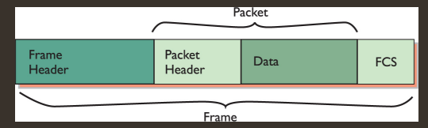

# Networking notes from CompTIA network+

CompTIA(Computing Technology Industry Association)

## 3.1.1 OSI Model

- **Full Form:** Open System Interconnect Model
- Osi Model Has 7 Layers. It's just a reference model btw.
  | L | Name | Usage/Description | Protocol Data unit | Device/Protocol | Memory Aid |
  | --- | ------------ | ----------------------------------------- | --------------------- | --------------- | ------------------ |
  | 7 | Application | | | HTTP/HTTPS | Away==All |
  | 6 | Presentation | To show how data should be formatted | | JPG/PNG | Pizza==People |
  | 5 | Session | Used to setup voice/videoCall | | SIP | Sausage==Seem |
  | 4 | Transport | Concerned with network connections | Segments | TCP, UDP | Throw==To |
  | 3 | Network | Forwarding desicions are made based on IP | Packets(or Datagrams) | Routers | Not==Need |
  | 2 | Data Link | Desicions are made based on mac addresses | Frames | Ethernet Switch | Do==Data |
  | 1 | Physical | Concerned with getting bits on the wire | bits | Data Cable | Please==Processing |

- **MAC**(Media Access Control) Addresses is a 48 bit address burned in to a NIC
- **P**rotocol **D**ata **U**nit: The name given to data at specific layers of the **OSI** model.
- TCP(Transmission Control Protocol) is reliable and connection based protocol.
- UDP(User Datagram Protocol) is unreliable and it is not connection based.
- HTTP: port 80, HTTPS: port 443

### Application(Layer4 in TCP:IP, Layer7 in OSI)

- Provides networking options to programs running on a computer. Accepts communication requests from programs directly.
- When data is given to the application layer, it passes it to the presentation layer

### Presentation Layer

- **Devices:** Data conversion
- **Data-unit:**
- **Protocols:** encrypt, decrypt
- Translates data from lower layers into a format usable by the application layer while data has to be received.
- Translates data from application layer into a format usable by the lower layers while data has to be send.
- Handles encryption, compression or other transformation of the data.
- Formats the data correctly for the session layer

### Session Layer

- **Devices:** Session tracking/naming software
- **Data-unit:**
- **Protocols:** SSL/TLS
- When data received from the presentation layer, it looks to see if it can connect to the destination computer.\
  If it can connect, the job of this layer is to maintain the session.
- Sync communication with other computer
- Making multiple requests to different endpoint is made possible by it.
- Data is passed down to transport layer

### Transport Layer

- **Devices:** Segmentation/Reassembly software
- **Data-unit:** Segments or Datagrams
  - Segments are given serial numbers. Datagrams don't need them as they are simpler.
- **Protocols:** IP
- Data is chopped into packets in this layer. This task is called segmentation
- It's first purpose is to choose the protocol over which the data is to be transmitted.
- Transport layer divides the transmission into bite-sized pieces which are called segments in TCP and datagrams in UDP.
- UDP(User Datagram Protocol) and TCP(Transmission Control Protocol) protocols are described in Transport Layer.
- UDP is a connectionless and unreliable protocol. Packet drop is not reported and retrieved
- TCP is a cconnection oriented protocol whhich is reliable. It retransmits the packet if it's dropped.
- TCP Protocol starts a connection with a three-way handshake.
  1.  Client machine sends a SYN packet. {Synchronization packet saying I want to make a connection}
  2.  Server machine sends a SYN packet and a ACK(Acknowledge) packet {SYN-> I want to connect as well, ACK-> I've got the syn packet successfully}
  3.  Host Machine Receives the SYN-ACK packet and sends a ACK packet{ACK->acknowledging that I got the packet successfully}

### Network(Layer3 in OSI model and Layer2 in TCP:IP model)

- **Devices:** Router. Routers can make desicions based on ip addresses.
  - Router connects subnets
- **Data-unit:** Packets
  - |                        |                     |      |
    | ---------------------- | ------------------- | ---- |
    | Recipient's IP address | Sender's IP address | Data |
  - Encapsulated ip packet(with frame header added):
  - 
- Network layer is responsible for locating the destination of request.
- IP(Internet Protocol) and ICMP(Internet Control Message Protocol) is in this layer
- IP is like truck. Ip will be carrying some upper layer protocols on top of it. Such As: UDP, TCP
- Network layer is called internet layer in tcpip model
- IP(Internet Protocol) and ICMP(Internet Control Message Protocol) protocols are described in Network/Internet leayer.

### Data-Link Layer

- **Devices**: Any device that works with MAC addresses are in data link layer. Eg: NIC, Switch
  - Switches handle traffic using mac addresses where hubs work like repeaters.
- **Data-unit:** Frames.
  - Frames are containers of a chunk of data moving across the network
  - |                 |              |      |      |     |
    | --------------- | ------------ | ---- | ---- | --- |
    | Recipient's Mac | Sender's Mac | Type | Data | FCS |
  - The Type field contains informtaion about what kind of data is in the frame.
  - Data field contains the data encapsulated inside the frame
  - FCS(Frame Check Sequence) are kind of indicator that the data did not get corrupted on the way. It's 4 bytes long.
- Data Link Layer has two subclasses.
  - LLC(Logical Link Control). Talks with the network operating software via device drivers.
  - MAC(Media Access Control). Talks with the other NIC via physical layer.
- PDU(Protocol Data Unit) in this section is frames. Frames are Layer2 PDU

### Physical Layer

- **Devices:** UTP(Unshielded Twisted Pair cable) and all other cabling, Hubs.
- Defines the method of moving data between computers.

## 4.1.2 TCP:IP Model

- TCP:IP model has 4/5 Layers depending on the implementation
  | Layer | Name | Replaced OSI | Memory Aid |
  | ------ | -------------- | ------------------ | ---------- |
  | Layer4 | Application | 5+6+7 | |
  | Layer3 | Transport | Transport | |
  | Layer2 | Internet Layer | Network | |
  | Layer1 | Network Access | Physical+Data Link | |
- Layer1 is also called
  - Network Interface
  - Link
  - Physical+Data Link
  - Physical+Network Interface

## NIC and MAC

- NIC(Networking Interface Card)
- 48 bit mac(Media Access Control) address is burnt into a rom chip in NIC. MAC is 12 hex characters long. 1 Hex = 4 bit.
- MAC addresses are also known as physical addresses
- Mac Addresses are represented like XX:XX:XX:XX:XX:XX. The first 6 digits are company specific. The last 6 is device speicfic.
- MAC-48, EUI-48, MAC are all the same thing
- NICs send and recieve data as pulses of electricity
- MAC FF:FF:FF:FF:FF:FF is the Layer2 broadcast address

## TCP

- Tcp connection uses segment doubling rule. Segment Window refers to how many segments are being sent.
- In every transmission cycle, the segment window gets doubled if no packet is dropped on the way.
- If client sent segment 10-18 but 14 number segment gets dropped, the server will send ACK-13 or acknowledging 13 number packet was received.

## IP

- IP has 4 8bit long numbers. Each 8 bit ranges from 0-255

## MTU(Maximum Transmission Unit)

The largest frame or packet that can be transmitted or received on an interface.

- In data transmission between two nodes, the MTU value should be the same. Otherwise the node with lower MTU value fragments the packet.\
  - If DF(Don't Fragment) byte is set, the node with lower MTU value drops the) packet
  - It sends a ICMP message saying Fragmentation needed for this perticular packet. In ipv6, PacketTooBig message is sent.

## Ports and Protocols

- **Well-Known-Ports:** 0-1023 Offer well known network services.
- **Registered Protocols:** 1024-49148 Registered with the Internet Assigned Network Authority for private services to avoid overlapping.
- **Ephemeral Ports:** 49152-65535 Dynamic Ports or Private Ports

### Common Protocols

- FTP - File Transfer Protocol - 20&21(TCP) {20 for transfer, 21 for control}
- SSH - Secure Shell - 22(TCP)
- SFTP - Secure FTP (FTP through SSH connection) - 22(TCP)
- FTPS - FTP Secure ( FTP service over SSL or TLS ) - 989&990(TCP) 989&990(UDP)
- Telnet - Connection to remote host with plaintext security - 23(TCP)
- SMTP - Simple Mail Transfer Protocol (Used for sending Email) - 25(TCP)
- SMTP over SSL/TLS - A Secure way of sending mails - 587(TCP)
- POP3 - Post Office Protocol Version3 - Retrieves email from email servers - 110(TCP)
- POP3 over SSL/TLS - Just a secured version of POP3 - 995(TCP/UDP)
- IMAP - Internet Message Access Protocol (Allows viewing of an email but does not download from the server) - 143(TCP)
- IMAP over SSL/TLS - Just a secured version of IMAP - 993(TCP)
- DNS - Domain Name System ( Resolves Domain Names to corresponding IP addresses) - 53(TCP) 53(UDP)
- TFTP - Trivial File Transfer Protocol (FTP without any authentication) - 69(UDP)
- DHCP - Dynamic Host Configuration Protocol ( Hey, Can somebody assign me an IP address?) - 67(UDP)
- HTTP - HyperText Transfer Protocol - 80(TCP)
- HTTPS - Hypertext Transfer Protocol Secure - 443(TCP)
- NTP - Network Time Protocol (Used by network devices to sync it's clock with a time server) - 123(UDP)
- LDAP - Lightweight Directory Access Protocol - 389(TCP)
- LDAP over SSL/TLS - Just a secured version of LDAP - 636(TCP)
- RDP - Remote Desktop Protocol - 3389(TCP)
- SIP - Session Initiation Protocol (Used for voice over protocols) - 5060&561(TCP/UDP)
- SMB - Server Message Block (Microsoft network for sharing resources) - 445(UDP)
- MySQL - MySQL server - 3306(TCP)
- SNMP - Simple Network Management Protocol (Trap is the keyword) -
