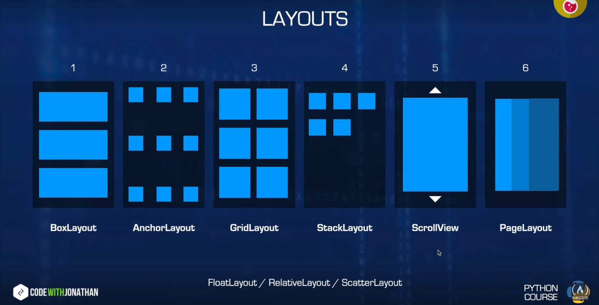

# Tkinter

```python
import tkinter as tk
```

- Widgets: GUI elements such as buttons, textboxes, labels, images
- Windows: Serves as a container to hold or contain widgets

## Creating window

```python
window = tk.Tk() # instantiate an instant of window

window.geometry("420x420")  # set the window resolution
window.geometry("420x420 + 100 + 50") # Position the window 100 px in x and 50 px in y on the screen

window.title("Title For the Window") # sets the window title

# Changing the icon of the window title
icon = tk.PhotoImage(file="filename.png")
window.iconphoto(true, icon)

window.config(background="#639cf7") # changes the window background

window.mainloop() # shows the window and places on computer screen, listens for events
```

## Labels

An area widget that holds text or image in a window

```python
label = tk.Label(window,
                text="Hello",
                font=('Arial', 40, 'bold'),
                fg="green",
                bg="black",
                relief=tk.RAISED,
                bd=10,
                padx=20,
                pady=20,
                image= photo,
                compound = "bottom")
    # instantiate a instance of label
    # here the parameter window is the container for the label
    # the text element is the text to be showed
    # the font element's Arial is the font family, 40 is the font size, bold is the font property
    # the fg, foreground is the text color. Hex values are also allowed
    # the bg, background is the background of the label.
    # the relief means the border of the label
    # the bd means the border width of the label
    # the padx means padding between the label and border in X direction
    # the pady means padding between the label and border in Y direction
    # the image has to be a photo object
    # the compound parameter says the image will appear in the bottom of the text
label.place(x=xCoordinate, y=yCoordinate)
    # placement of the label
    # if place is used, pack doesn't need to be mentioned

label.pack()
    # attach the label with the master. Just instantiating does not attach it by default
    # if label.place() is used, pack does not need to be used

photo = tk.PhotoImage(file="file.png")
    # creates a photo object suitable to handle for tkinter
```

**Button:**

You click them, they do stuff

```python
button = tk.Button(window,
        text="click me",
        command=click)
        # the window is the master/parent/container of the window
        # the command holds the callback function which will be executed while the function is called. The function has to be declared elsewhere
        #
button.pack()   # to attach the button to the window
```

## Framing

```python
frame = tk.Frame(window)
frame.pack(fill='both', expand=1)
    # Expand means the frame is resizable
    # fill both means the frame will take the whole place
```

## TTK

```python
from tkinter import ttk
```

## Canvas

```python
canvas = tk.Canvas(window,
                    width=width,
                    height=height,
                    bd = borderWidth,
                    cursor="cursorname" # search for tkinter canvas cursors
                    )
```

## Events

```python
def callBackHandlerFunction(event):
    print(event)    # do whatever you wanna do with the event variable


element.bind("<Button-1>", callbackHandlerFunction)  #
    # Button-1 Left mousebutton,
    # Button-2 Middle mousebutton,
    # Button-3 Right mousebutton
    # Enter for mouse hover
    # Leave for mouse hover done(when the mouse leaves)
    # FocusIn for tabbing focus
    # Return for getting input from Enter key
    # Key for getting input from any key  => event.keysym for getting the key that was pressed


id = tk.element(definition)
canvas.tag_bind(id, "<Button-1>", lambda x:function(parameter))
```

## Multi page Software

```python
conntainer = tk.Frame(window)
container.pack(side="top", fill="both", expand=True)


container.grid_rowconfigure(0, weight = 1)
container.grid_columnconfigure(0, weight = 1)

```

## **Kivy Notes**

## Basics to get started

```python
from kivy.app import App    # for the main app
from kivy.uix.widget import Widget # for the widgets

class MainWidget(Widget):
    pass

class ProjectNameApp(App): # the 'App' after classNameApp is important by convention
    pass

app = ProjectNameApp.run() # runs the app
```

A file named projectname.kv is needed to organize the gui

## Layout Basics



```kivy
MainWidget:
<MainWidget>:
    Button:
        text: "Text on button"
        size: "widthdp", "heightdp"
        pos: "xdp", "ydp"
        color: r, g, b, a   # rgba from 0-1 for text color
    Label:
        text:
        size:
        pos:
        color:
```

- In kivy, (0, 0) starts from bottom left
- DP -> Density independant Pixels
- 40dpx40dp is the size of exact finger touch

## Box Layout

```python
from kivy.uix.boxlayout import BoxLayout
from kivy.uix.button import Button

class Layout(BoxLayout):
    def __init__(self, **kwargs):
        super()__init__(**kwargs)

        # self.orientation = "vertical" # for vertical alignment

        b1 = Button(text="text")
        b2 = Button(text="text2")

        self.add_widget(b1)
        self.add_widget(b2)
```

Default Orientation is horizontal. But the following code makes the orientation vertical

```python
self.orientation = "vertical"
```

**For Kivy File:**

```kivy
BoxLayoutExample:

<BoxLayoutExample>:
    orientation: "vertical"
    Button:
        text: "A"
        size_hint: widthP, heightP # p between 0-1
    Button:
        text: "B"
        size_hint: None, None   # needed to activate manual sizing. Stops using size_hint to manage sizes
        size: "widthdp", "heightdp" # for manual sizing
    Button:
        text: "C"
        size_hint: None, None
        width: "widthdp"
        height: "heightdp"
    Button:
        text: "D"
        size_hint: 0.5, None

        height: "heightdp"

        pos_hint: {
            "x": 0-1
            "center_x": 0.5 # makes the button be in the center
            }
        # For Pos Hint,
            # x, center_x, right in x axis || y, center_y, top in y axis
```
