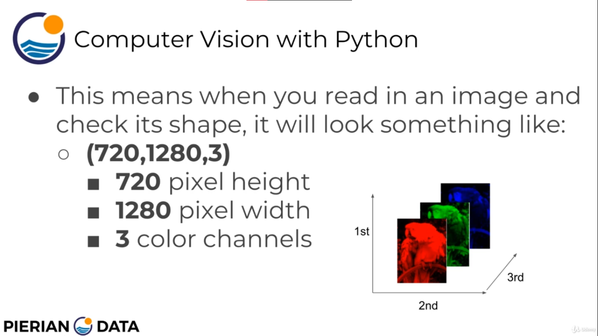

# Opencv From Udemy

## Anaconda

- `conda env create -f configfile.yml` creates an virtual environment from .yml file.
- `conda activate python-cvcourse` for activating environment
- `conda info --envs` shows information about the environment
- `conda deactivate` to deactivate environment.

## Jupyterlab

- `jupyter-lab` for starting jupyter lab in browser
- `shift+enter` to execute code in jupyter lab.

## Numpy

- [numpy docs](https://numpy.org/doc/stable/user/quickstart.html)

**Numpy Arrays:**

```python
import numpy as np

pylist = [1, 2, 3, 4]
type(pylist) # returns list
nparray = np.array(pylist)
newArray = nparray.copy()   # Creating a copy of npArray
type(nparray)   # returns numpy.ndarray
```

```python
np.arange(0, 5) # 0=>starting point, 5=>ending point(not includes 5)
    # array([0, 1, 2, 3, 4])
np.arange(0, 10, 2) # 2=> step size
    # array([0, 2, 4, 6, 8])

np.zeros(shape=(rows, columns))
    # creates multidimentional array full of zeros (float type by default)
np.ones(shape=(rows, columns))
    # same as np zeros
```

```python
np.random.seed(101) # Provide a seed for the numpy random array
arr =  np.random.randint(lowestRange, HighestRange, numberOfElements)
    # randint -> random integer
arr.max() # returns the maximum value present in an array
arr.min()

arr.argmax() # returns the index of the maximum value in the array
arr.argmin()

meanValue = arr.mean()  # calculates the average value of the array elements
arrShape = arr.shape # returns the shape of the array
reshapedArray = arr.reshape((row, column)) # returns the reshaped array
```

```python
mat = [[    ],
       [    ],
       [    ],
       ]
# here mat is multi dimentional array

# To access an element of the array,
mat[row, column]
mat[row][column]
```

**Slicing:**

```python
arr[:, 1]   # Shows all the elements in column 1 -> I want elements of every row && column == 1
arr[1, :]  # shows all elements in row 1 -> I want elemnts of every column && row == 1
arr[0:5, 0:5] = 0 # makes all values in this range = 0
```

## Images and numpy



- Cannot directly use numpy on images. Need PIL (Python Imaging Library) for working with images

**matplotlib pyplot:**

- matplotlib is the library that will Plot out and display image in the notebook

```python
import matplotlib.pyplot as plt
```

**PIL:**

```python
import PIL
```

- Opening Images with PIL that numpy can understand

```python
pic = PIL.Image.open("imagepath") # Opens the image in a way numpy can understand

pic_arr = np.asarray(pic)   # Converting opened pic to numpy array which numpy can handle

pic.show()  # Shows the image in image viewer

plt.imshow(pic_arr) # for showing numpy array as image
plt.show()  # This line is also needed

plt.imshow(pic_arr, cmap='gray')    # For showing image in gray colormap
```
