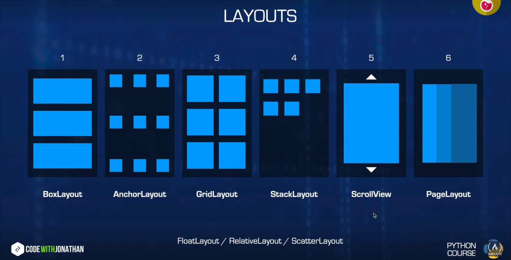

# Kivy Notes

## Basics to get started

```python
from kivy.app import App    # for the main app
from kivy.uix.widget import Widget # for the widgets

class MainWidget(Widget):
    pass

class ProjectNameApp(App): # the 'App' after classNameApp is important by convention
    pass

app = ProjectNameApp.run() # runs the app
```

A file named projectname.kv is needed to organize the gui

## Layout Basics



```kivy
MainWidget:
<MainWidget>:
    Button:
        text: "Text on button"
        size: "widthdp", "heightdp"
        pos: "xdp", "ydp"
        color: r, g, b, a   # rgba from 0-1 for text color
    Label:
        text:
        size:
        pos:
        color:
```

- In kivy, (0, 0) starts from bottom left
- DP -> Density independant Pixels
- 40dpx40dp is the size of exact finger touch

## Box Layout

```python
from kivy.uix.boxlayout import BoxLayout
from kivy.uix.button import Button

class Layout(BoxLayout):
    def __init__(self, **kwargs):
        super()__init__(**kwargs)

        # self.orientation = "vertical" # for vertical alignment

        b1 = Button(text="text")
        b2 = Button(text="text2")

        self.add_widget(b1)
        self.add_widget(b2)
```

Default Orientation is horizontal. But the following code makes the orientation vertical

```python
self.orientation = "vertical"
```

**For Kivy File:**

```kivy
BoxLayoutExample:

<BoxLayoutExample>:
    orientation: "vertical"
    Button:
        text: "A"
        size_hint: widthP, heightP # p between 0-1
    Button:
        text: "B"
        size_hint: None, None   # needed to activate manual sizing. Stops using size_hint to manage sizes
        size: "widthdp", "heightdp" # for manual sizing
    Button:
        text: "C"
        size_hint: None, None
        width: "widthdp"
        height: "heightdp"
    Button:
        text: "D"
        size_hint: 0.5, None

        height: "heightdp"

        pos_hint: {
            "x": 0-1
            "center_x": 0.5 # makes the button be in the center
            }
        # For Pos Hint,
            # x, center_x, right in x axis || y, center_y, top in y axis
```
