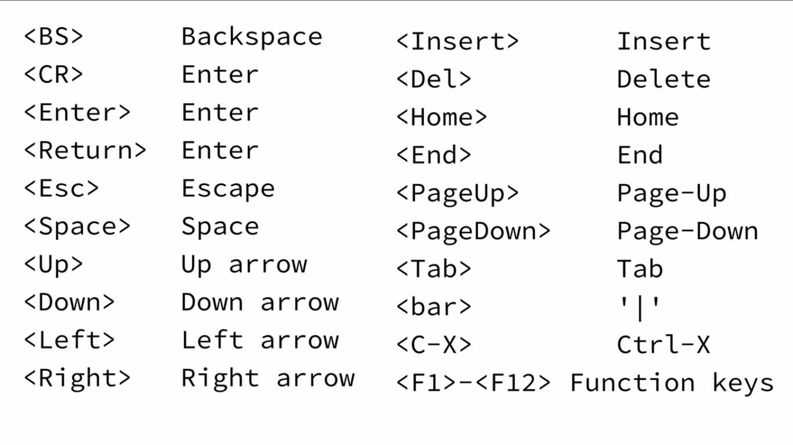

# Used commands in vim

## Vim Modes

* Normal Mode (or Command Mode)
* Insert Mode
* Line Mode

## Normal mode command pattern

anything inside [] is **[optional]**\
operation\
{motion}\
[count]operation\
[count]{motion}\
[count]operation{motion}\
[count]operation[count]{motion}

## Commands

* **```:E[xplore]```** shows the files in the current directory to be explored
* **```command1 | command2```** works as a command seperator for vim
* **```:w[rite]```** Writes the file\
* **```:q[uit]```** Quits the vim editor\
* **```!```** Using bang after any command means to force that command{used to toggle in some other commnds}\
* **```.```** Repeat previous commnad\
* **```:f[ile]```** Shows informations about the file. Similar to ```ctrl+g``` ```1ctrl+g``` shows the full path  
* **```:reg[isters] [registername]```** Displays type and content of all registers
* **```:e[dit] filePath```** Opens the file from specified path to edit in vim

## Navigation

* Move down a line: ```j```
* Move up a line: ```k```
* Move to the right: ```l```
* Move to left: ```h```
* Move one word to the right: ```w``` {```w``` treats punctuation marks as a word}\
  Move n words to the right:```nw```
* Move one word to the right: ```W``` {```W``` does not treat punctuation marks as a word so ignores them}
* Move one word to the left/backward: ```b``` {```b``` treats punctuation marks as a word}
* Move one word to the left/backward: ```B``` {```B``` does not treat punctuation marks as a word so ignores them}
* Move forward/pageDown: ```ctrl+f```
* Move backward/pageUp: ```ctrl+b```
* Reposition the screen: ```z+enter``` {Keeps the cursor to the specified line and scrolls the line to the top/near the top of the screen}
* Position cursor to the beginning of the line: ```0```
* Position cursor to the first character of the line ```^``` {Similar as regExp}
* Position cursor to the last character of the line ```$``` {Similar as regExp}
* Go to line n of the file: ```n+gg``` or ```n+G```\
  Go to line n of the file: ```:n```
* Go to the top of the file: ```gg``` {for ```gg```, if no line number is set, it takes 1 as the default line number}\
  Go to the top of the file: ```:^```
* Go to the end of the file ```G``` {for ```G```, if no argument is set, it takes last line as the default line number}\
  Go to the top of the file ```:$```
* Display information about the file(file location, line numbers and current line number) ```ctrl+g```
  
## Vim options and Customizations

```:set [option]``` Sets the option on
```:set [option]!``` Bang at the end of the option toggles the option
```:set [option]?``` for checking whether the option is set or not
```set [option]&``` set the value of the command to default value

```bash
set is        # Sets incremental search on
set incsearch # Sets incrementsal search on

set hls[earch]    # Sets highlighting search results on
                  # :nohls removes the highlights from the previous search   
set nu[mber]      # Sets the line number
set shiftwidth=4  # sets shiftwidth
set tabstop=4     # sets tabstop
set list          # Shows the actual characters used in the text file e.g. ^I instead of tab
set expandtab     # does not utilize tab
set history=500   # remembers 500 histories
set ruler         # sets a ruler at the cursor position
set showcmd       # Shows the incomplete commands in the bottom right
set scrolloff=5   # keeps 5 lines at top/bottom while using z+Enter
```

### Colorscheme

* ```color+ctrl+d``` for showing all the available color schemes

### For vimrc

* rc means run command
* ```:h option-list``` lists all the options available to put inside vimrc
* ```:options``` opens a list of all options with a breif description

### Remapping



## Deleting

Deleting in general:\
d {other command} -> delete according to the other command.

* Deleting a single character at the cursor position: ```x```
* Deleting a single character left to the cursor position: ```X```

**Talking in vim language:**\

* Deleting a single word from the cursor position: ```dw``` {deletes every single character until it finds space}\
  Deleting n words from the cursor position: ```ndw```
* Delete everyting to the last character of the line from the current position: ```d$``` or ```D```
* Delete everyting to the first character of the line from the current position: ```d^```
* Delete everything to the beginning of the current line: ```d0```
* Delete everything to the first line of the file from current cursor position: ```dgg```
* Delete everything to the last line of the file from current cursor position: ```dG```
* Delete current line: ```dd```
* Delete n lines: ```ndd```
* Delete everything to the next line from the cursor potition(including present line): ```dj```
* Delete everything to the previous line(including present line): ```dk```

## Vim help

**```:h[elp] command/{subject}```*** Shows help menu\

* ```ctrl+i``` gets to the next/(the command backed from) searched help
* ```ctrl+o``` gets to the previous searched help{similar to back button in browsers}\
* ```ctrl+]``` on any word of the help documentation emulates ```:help word``` program
* ```ctrl+ww``` allows to edit the file while keeping the help documentation on. Toggles the cursor between the files.
* ```:h :q<ctrl+d>``` for command completion. Lists all the commands starting with q.\
* ```:h option-list``` lists all the options to set/unset in vim
  It actually searches the pattern before the ```ctrl+d``` keybinding.\
  Same thing can be done by pressing ```tab``` key after the pattern with the wildmenu. ```shift+tab``` for selecting backwards.\
  ```wildmenu``` could be set and unset
* ```:h ^<key>``` In help menu, ```ctrl+<key>``` keybinding is searched replacing ctrl with  ```^```

## Cut, Copy, Paste, Undo

* Cut a line ```dd``` {dd saves the line inside the default register}
* Copy a line ```yy```
* Cut or copy a line inside blackHole register ```"_dd/yy```
* Undo last action ```u```
* Redo the last undoed action ```ctrl+r```
* Paste after the cursor position ```p```{p is for put/paste}
* Paste before the cursor position ```P```
* Paste from register n ```"np/P```
  
## Registers

```:reg[isters] [registerName]``` shows all the registers and their contents

* **Unnamed=**""\
  "" holds text form d, c, s, x and any y operation
* **Numbered=**"0 "1 ... "9\
  "0 Holds last text yanked(```y```)\
  "1 Holds last text deleted(```d```) or changed (```c```)\
  Numbered registers shift with each d or c
* **Named=**"a ... "z\
  To put inside the specified register: ```"ayy```\
  To append inside the specified register: ```"Ayy```\

## Insert mode entering techniques

* ```i``` starts insert mode at the cursor position.
* ```I``` starts insert mode at the beginning of the line of cursor position.
* ```a``` starts insert mode at one character after the cursor position.
* ```A``` starts insert mode at the end of the line of cursor position.
* ```o``` starts insert mode at one line after the line of cursor position.
* ```O``` starts insert mode at one line before the line of cursor position.
* ```R``` starts replace mode at the cursor position.
* ```r``` starts replace mode at the cursor position but returns back to normal mode immediately after one character is typed.
* ```c<motion>``` starts insert mode after deleleting according to the specified command after it.
* ```C``` starts insert mode at the cursor position after deleting everything to the end of line.
* ```cc``` starts insert mode after deleting the current line. Similar to ```cdd``` command
* ```"rc<motion>``` starts insert mode and stores the deleted text inside specified register
* ```~``` toggles capitalization of the character under the cursor.
* ```g~<motion>``` toggles the capitalization of the entire motion.
* ```g~~``` toggles the capitalization of the entire line.
* ```gU<motion>``` makes everything uppercase of the motion.
* ```gUU``` makes the entire line uppercase.
* ```gu<motion>``` makes the motion lowercase.
* ```guu``` makes the whole line lowercase.
* ```J``` replaces the newline at the end of current line with ```<space>```. Thus, two broken lines gets together.
* ```gJ``` works similarly to ```J``` but adds no space.

## Insert mode hacks

* ```n i/I/a/A/o/O``` then edit and escape. This command repeats the edit n times

## Seearch, Find and replace

**All of the inline search comamnds are treated as ```<motion>```**

* ```f<character>``` searches the specified character on the same line the cursor is located.\
   It only searches instances to the right. This searching method is case sensitive.
* ```F<character>``` searches the specified character on the same line the cursor is located.\
  It only searches instances to the left. It's also case sensitive
* ```T<character>``` **Backward Till:** same as ```f``` but puts the cursor after the specified character.
* ```t<character>``` **Forward Till:** same as ```f``` but puts the cursor before the specified character.
* ```;``` Repeats the last one line search operation.
* ```,``` Repeats the last one line search operation but in the opposite direcetion.

* ```/searchterm``` **Forward search:** searches the specified searchterm. Here ```/``` means incremental search
* ```?searchterm``` **Reverse search:** searches the specified searchterm. It does it in decremental fasion.
* ```n``` is used for jumping to the next found item.
* ```N``` is used for jumping to the previous found item.
* ```*``` finds the next occurance of the word the cursor is on.
* ```#``` finds the previous occurance of the word the cursor is on.
  @
**Substitute and others**\

* ```:[range]s/old/new/[flags]...``` searches the old and replaces with new.
* ```:[range]s#old#new#[flags]...``` is also a valid syntax while working with directory paths.
* **Flags:**
  * No flags with this command replaces only the first occurance of the current line.
  * ```g``` flag replaces all occurance to the current line. Otherwise it'll only replace the first occurance.
* **Range:**
  * ```:1,5s/old/new/[flags]...``` here, range is separated by comma.
  * ```:.,$s/old/new``` replaces all old with new from current line to the last line. ```.``` current and ```$``` last line.
  * ```%``` range is used for entire line.
  * ```:/pattern1/,/pattern2/s/old/new/g``` will change everything inside the pattern range


## Text objects and macros

**Basic Syntax:** {operator}{a}{object} or {operator}{i}{object}

* ```[d/c]aw``` on a word, deletes/changes a word under the cursor and deletes following whitespace as well.
* ```[d/c]iw``` on a word, deletes/changes a word under the cursor but does not delete the whitespaces.
* ```[d/c]as``` on a sentence, deletes/changes a sentence under the cursor and deletes the following whitespace as well.
* ```[d/c]is``` on a sentence, deletes/changes a sentence under the cursor but does not delete the following whitespace.
* ```[d/c]ap``` on a paragraph, deletes/changes a paragraph under the cursor and deletes following new line as well.
* ```[d/c]ip``` on a paragraph, deletes/changes a paragraph under the cursor but does not delete following new line.
* ```[d/c]i[ {/}/(/)/[/]/</> ]``` on a line, does the following:
  * ```colors=[ (/{/[/< ]'red', 'green', 'blue'[ >/]/}/) ]```\
    giving the command while cursor inside the brackets, deletes/changes everything between the braces
* ```[d/c]a[ {/}/(/)/[/]/</> ]``` on a line, does the following:
  * ```colors=[ (/{/[/< ]'red', 'green', 'blue'[ ]/}/)/> ]```\
    giving the command while cursor inside the brackets, deletes/changes everything and the bracket as well
* ```[c/d/y]it``` is for working with html tags which copy/change/deletes everything inside of the tags
* ```[c/d/y]at``` is for working with html tags which copy/change/deletes everything inside including the tags

## Macros

Macros are recorded keystrokes. They are recorded inside registers.

* ```q[register]``` command in normal mode starts recording a macro inside specified register
* ```@[register]``` command in normal mode replays the keystrokes from the specified register
* ```@@``` command replays the keystrokes from the most recent macro
* ```[beginningOftheRange, endingOftheRange]normal @[register]``` applys the keystrokes saved inside specified register on the range
* ```"ay@``` to save a keystroke sequence inside register as macro

**Pre Recorded Macros in .vimrc:**

* ```let @[register] = '[key sequence]'```
* ```ctrl+v [character]``` for inserting literal characters

## Visual Mode

There are three versions of visual mode.

* ```v``` for characterwise visual mode {```v``` for returning to the normal mode again}
  * ```o``` moves the cursor to the opposite end while keeping the highlight
  * ```u``` lowercase whole selection
  * ```U``` uppercase whole selection
  * ```~``` toggle whole selection
  * ```>``` to shift selected text
* ```V``` for linewise visual mode
  * ```<``` SE
* ```ctrl+v``` for blockwise visual mode
  * ```O``` in visual mode jumps back and forth in a line
  * ```$``` for reaching the selection to the end of every line of the motion.
  * ```A``` Append after each selected line. ```a``` does not work in visual mode
  * ```I``` Insert before each selected line. ```i``` does not work in visual mode
* ```gv``` reselect the last visual mode selection
* ```:``` to enter command mode from visual mode
  * ```ce[nter]``` centeres all the text
  * ```le[ft]5``` lefts all the selected text with 5 spaces on the left

## Vim Buffers

* ```:buffers``` shows all open buffers
* ```:ls``` does the same thing
* ```:b [buffer number]/[buffer name]``` to show the specified buffer on the current window
* ```:b <tab>/<ctrl+d>``` opens a options tab to choose from the buffers
* ```:bn/bnext``` opens the next buffer
* ```:bp/bprevious``` opens the previous buffer in the current screen
* ```:bl/blast :bf/bfirst``` opens the last buffer of the list
* ```<ctrl+^>``` works as ctrl+tab in buffers
* ```:set hidden``` solves the problem while switching through buffers by enabling hidden mode
* ```:wall``` save changes of all buffers
* ```:badd fill.ext``` adds the specified file to the buffer list
* ```:bd file.ext``` deletes the specified buffer from the list
* ```:1,3bd``` deletes the buffers from the specified range
* ```:%bd```  Deletes all the buffers from the buffer list
* ```:bufdo <command>``` execute command on all buffers

## Vim Windows

* ```:h c-w``` shows the help documentation of colon 
* ```ctrl+ww``` cycles through the open windows
* ```ctrl+w[jkhl]``` for cycling through windows using navigation keys 
* ```:sp/split``` split the screen horizontally
* ```ctrl+w s``` splits the screen horizontally
* ```:vs``` splits the screen vartically
* ```:vs file.txt``` splits the screen vertically and opens the specified file in the new window
* ```:on / ctrl+w o``` removes all the other windows except the current window 
* ```ctrl+w [+-><=_|]``` for resizing the windows 
* ```ctrl+w [rR]``` rotates the position of the windows 
@@@@@@@@@@@@@@@@@@