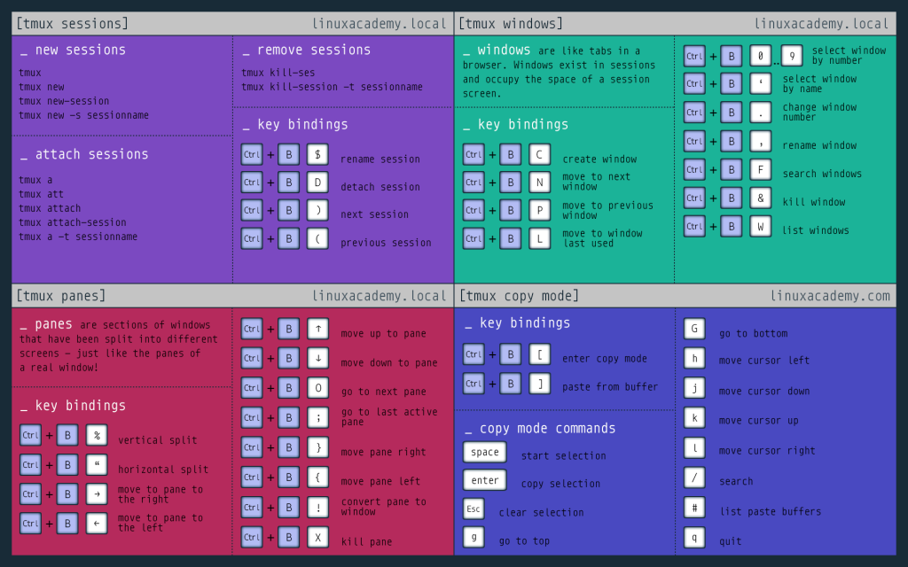

# TMUX rules and tricks

Go to [this link](https://tmuxcheatsheet.com/) if something is missing here\
\

**Base Command syntax:** ------------ ```ctrl+b <command>```\
**Creating a new window:** ---------- ```ctrl+b c```\
**Renaming current window:** -------- ```ctrl+b ,```\
**Changing Windows:** --------------- ```ctrl+b p``` ```ctrl+b n``` {p for previous, n for next}\
**List Windows:** ------------------- ```ctrl+b w```\
**Split Vertically:** --------------- ```ctrl+b %```\
**Split Horizontally** -------------- ```ctrl+b "```\
**Creating a new Session:** --------- ```tmux new -s session_name```\
**List Running Session:** ----------- ```tmux list-sessions```\
**Detaching from a Session:** ------- ```ctrl+b d```\
**Reattach to an existing session:**  ```tmux attach -t session_name```\
**Scroll:** ------------------------- ```ctrl+b [``` {and then use arrow keys. ```q``` for quitting the scrolling mode}
