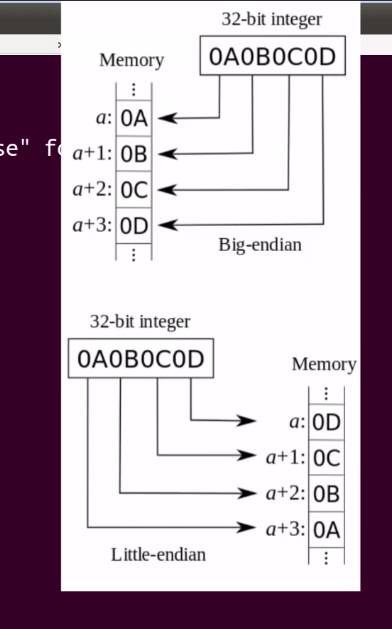

# Notes on learning from liveroverflow Binary Exploitation

## Video 0x02

- `env` in bash shows all the environment variables.
- `whereis executable` Shows the location of the executable in the machine.
- Selecting a bunch of text in the terminal and then clicking the mouse-wheel button pastes it on the cursor position
- `export PATH=path1:path2:path3` sets the path variable
- `man 3 printf` Shows the manual page of the printf function
- `gcc filename.c -o outputBinaryName -Wall`
  - `-o` To select the output binary name
  - `-Wall` To enable all warnings
- `fprintf(stderr, "text");` Prints the text to stderr
- `./matrix mairala` to pass single word argument,
- `./matrix "kaittala mairala"` to pass double word argument
- `./matrix $VAR` to pass shell variable as argument
- `./matrix \$VAR` Need to escape the `$` to pass a string otherwise shell will translate it.
- `echo $?` shows exit status

## Video 0x03

- C is a compiled language, whereas python is an interpreted language.
- `file executable` shows which type of executable the file is
- `vim -O file1, file2` Opens two files in vertical split
- `:!command` Runs command inside vim
- `:!python %` Executes the current selected file in vim
- `sys.argv` is a list
- `sys.stderr.write("text")` to write text as stderr to the console

## Video 0x04

Basic Assembly language stuff

## Video 0x05

GDB related tutorials

- `gdb binaryFile` will start debugger
- `disassemble main` will show all the assembly instructions of the main function.
- `set disassembly-flavor intel` sets the disassembly flavor to intel
- `break *main` put a breakpoint at the start of main
- `run` or `run arguments` to start execution of the program
- `info register` shows the condition of all the registers
- `si` For stepping 1 instruction {incrementing ip with 1 instruction}
  - `si` will step into function calles as well, so use `ni` instead if that's suitable
- `ni` for next instruction
- To repeat previous command need to press enter
- `continue` will run the program normally again until hits the next break point.
- `set $eax=0` sets the register value of eax to 0

## Video 0x06

- `hexdump -C executablefile` Hexdumps in a pretty format of the executable
- `strings filename` will print all printable characters of a certain length from a file
- `objdump -d executable` will dump the disassembly for the executable
- `objdump -x executable` for header file speculation
- Strings could be found in .rodata section
- `x/s 0xaddress` shows the string in that address
- `strace ./executable` strace traces syscalls and signals
- `ltrace ./executable` ltrace traces library functions. Need to compile with `-no-pie` flag
- `execve` is a function which tells the linux kernel to execute specified executable program

[Solve of ltrace issue](https://stackoverflow.com/questions/34519521/why-does-gcc-create-a-shared-object-instead-of-an-executable-binary-according-to/34522357#34522357)

Radare2 Stuffs

- `r2 executable` start radare execution on executable
  - `?` shows the help text
    - `a?` Will show what a means
  - `aaa` Autometically Analyze and Autoname Functions
  - `afl` Print all functions radare found
  - `s` Seek to a function
    - `s sym.main`
  - `pdf` Print the disassembly of the current function
  - `VV` to enter visual mode

## Video 0x07

Radare2 Stuffs

- `ood` Open the executable file in debug mode
- `dc` Run the program
  - `dc arguments`
- `rax2 0xhexvalue` in raw terminal or `!rax2 0xhexvalue` inside radare, converts hex to decimal
- `db address` to put a breakpoint in the specified address
- `dr` to show the registers
  - `dr rip=0xaddress` to modify rip register value
- `afvn new_name old_name` changes the variable name radare set
- `p` in visual mode displays the addresses
- `v!` to get into more fancier debug mode
- `chr(hexValue)` converts hexValue to ascii character
- `ord(character)` shows the

## Video 0x08

- `random.randint(lowestInt, hightInt)` will select a random integer between lowest and highest
  - need to `import random` to use this functoinality

## Video 0x09

- `man 2 write` shows the manual for syscall write
  - 1 for filedescriptor argument means "write mode"
- `r2 -d ./executable` to open the executable in debug mode
- Only can access level 0 with a syscall. But cannot control what happens there

## Video 0x0A

- `int('1101', 2)` in python means the string 1101 is a binary value and it has to be converted into integer
- `bin(integerValue)` in python converts integerValue to binary
- `hex(integerValue)` in python integer to hex
- 4 bits = 1 nibble
- `codecs.encode(b"value", 'hex')` encodes anything into hex. Need to `import codecs` before using
- `struct.unpack("I", b"string")[0]` Unpacks the string into unsigned integer in little endian mode
- `struct.unpack(">I", b"string")[0]` Unpacks the string into unsigned integer in Big endian mode
- `struct.pack("I", data)` For packing the data for exploitation
  - need to `import struct` to use it
  - Use it inside `hex()`
- Endianness
  - 

## Video 0x0B

- setuid sets the effective calling id of the calling process
  - if setuid is set, whenever the program is executed, it gets executed by the owner of the file.
- `info proc mapping` shows the memory mapping
- `x w/x $register` shows the value in the memory location which the register is holding
  - `x/24wx $register` examine memory addresses for 24 words.
- `define hook-stop` Defines a hook{bunch of commands to execute when gdb stops at certain point}
  - put commands one after another and then type end when finished doing so
  - `info registers`
  - `x/30wx $esp`
  - `x/2i $eip`
- `\x0a\x0b` to handle hex

## Video 0x0D

- `x functionName` shows the memory address of the function
- `print functionName` shows the memory address of the function
  `AAAABBBBCCCCDDDDEEEEFFFFGGGGHHHHIIIIJJJJKKKKLLLLMMMMNNNNOOOOPPPPQQQQRRRRSSSSTTTTUUUUVVVVWWWWXXXXYYYYZZZZ`
- 